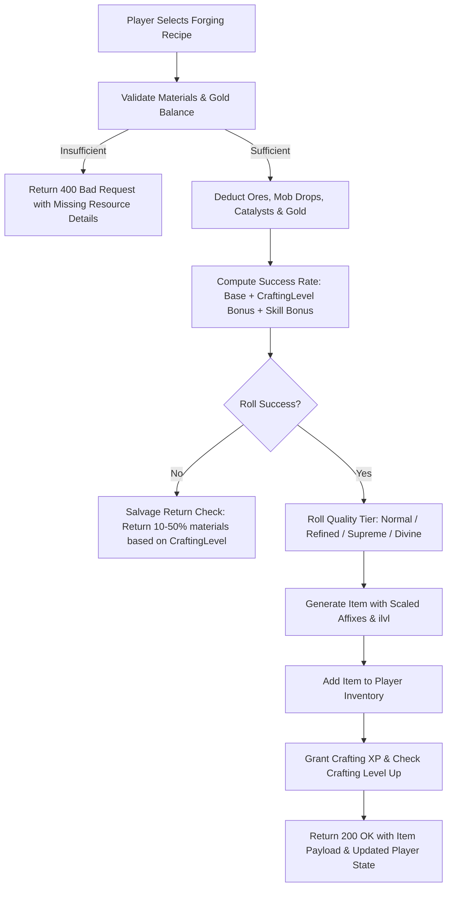

# Nghịch Thiên Ký — Equipment Forging & Enhancement Specification
*Standard Technical Reference for Equipment Crafting, Tiered Forging, and +1 to +12 Enhancement Progression*

---

## 1. Executive Summary

This document specifies the architecture and mathematical models for **Equipment Forging (Đúc Khí)** and **Equipment Enhancement (Cường Hóa Trang Bị +1 đến +12)**. These two interconnected subsystems close the economy loop, allowing materials gathered through mining (`khai_khoang`), beast slaying (`combat`), and boss drops (`catalysts`, `da_cuong_hoa`) to be transmuted into weapons, armors, shields, and accessories with escalating power curves.

---

## 2. Equipment Forging Architecture (`ForgingService`)

### 2.1. Structural Flow

### 2.2. Recipe Catalog & Progression Matrix

The forging catalog spans 5 canonical cultivation tiers:

| Tier | Category | Recipe Name | Target Slot | Base Type | Required Key Materials | Base Rate | Gold Cost |
| :--- | :--- | :--- | :--- | :--- | :--- | :---: | :---: |
| **T1** | Luyện Khí | Thiết Kiếm | `weapon` | `sword` | Thiết Khoáng Thô $\times 3$, Da Thô $\times 2$ | 95% | 20 |
| **T1** | Luyện Khí | Thô Bì Hộ Giáp | `body` | `armor` | Da Thô $\times 4$, Xương Vụn $\times 2$ | 95% | 20 |
| **T1** | Luyện Khí | Bạch Cốt Khiên | `shield` | `shield` | Xương Vụn $\times 5$, Quặng Đồng $\times 2$ | 90% | 25 |
| **T1** | Luyện Khí | Trữ Vật Giới Chỉ | `ring` | `tru_vat_gioi` | Mảnh Không Gian $\times 2$, Quặng Đồng $\times 3$ | 85% | 50 |
| **T2** | Trúc Cơ | Tinh Cương Kiếm | `weapon` | `sword` | Quặng Bạc $\times 4$, Kim Loại Linh $\times 3$ | 85% | 60 |
| **T2** | Trúc Cơ | Giáp Thiết Trùng | `body` | `armor` | Kim Loại Linh $\times 4$, Vỏ Cứng $\times 3$ | 85% | 70 |
| **T2** | Trúc Cơ | Hỏa Linh Đao | `weapon` | `saber` | Tinh Hỏa $\times 3$, Kim Loại Linh $\times 4$, Lông Hỏa $\times 2$ | 80% | 90 |
| **T2** | Trúc Cơ | Băng Phách Hài | `feet` | `boots` | Băng Phách Thạch $\times 3$, Da Rắn $\times 3$ | 85% | 65 |
| **T3** | Kim Đan | Huyết Lang Vương Kiếm | `weapon` | `sword` | Răng Sói Vương $\times 2$, Huyết Tinh $\times 3$, Thiết Huyết Quặng $\times 4$ | 75% | 160 |
| **T3** | Kim Đan | Thiết Huyết Huyền Giáp | `body` | `armor` | Thiết Huyết Quặng $\times 6$, Huyết Tinh $\times 3$, Tinh Thạch $\times 3$ | 75% | 180 |
| **T3** | Kim Đan | Lôi Kiếp Thần Thương | `weapon` | `spear` | Lôi Kiếp Thạch $\times 4$, Lôi Vũ $\times 3$, Huyền Thiết $\times 3$ | 70% | 220 |
| **T3** | Kim Đan | Hư Không Nạp Giới | `ring` | `tru_vat_gioi` | Hư Không Tinh $\times 2$, Quặng Vàng $\times 4$, Tinh Thạch $\times 3$ | 70% | 280 |
| **T4** | Nguyên Anh | Thiên Ngoại Huyền Đao | `weapon` | `saber` | Thiên Thạch $\times 4$, Nanh Bá Vương $\times 2$, Huyền Thiết $\times 5$ | 60% | 500 |
| **T4** | Nguyên Anh | Tinh Tiêu Bát Quái Bào| `body` | `armor` | Tinh Tiêu Thạch $\times 5$, Lôi Đế Vũ $\times 3$, Tàn Phiến Trận Đồ $\times 2$ | 60% | 600 |
| **T5** | Hóa Thần | Bản Nguyên Tru Tiên Kiếm | `weapon` | `sword` | Bản Nguyên Tinh $\times 2$, Hỗn Độn Khí Tinh $\times 2$, Hỗn Nguyên Đạo Châu $\times 1$ | 45% | 2,000 |
| **T5** | Hóa Thần | Huyết Ma Bất Hoại Thần Giáp | `body` | `armor` | Huyết Ma Bản Giáp $\times 3$, Bản Nguyên Tinh $\times 2$, Cửu U Hắc Thủy $\times 2$ | 40% | 2,500 |

### 2.3. Quality Tiers & Crafting Mastery Synergies

Each successful forge rolls a quality tier influenced by player's `craftingLevel`:

$$\text{Critical Quality Chance} = \begin{cases} 
12\% & \text{if } \text{CraftLevel} \ge 76 \\ 
8\% & \text{if } \text{CraftLevel} \ge 50 \\ 
4\% & \text{if } \text{CraftLevel} \ge 25 \\ 
1\% & \text{otherwise} 
\end{cases}$$

* **Phàm Phẩm (`normal`):** Standard baseline affixes.
* **Tinh Phẩm (`refined`):** $+15\%$ to all rolled affix values.
* **Cực Phẩm (`supreme`):** $+30\%$ affix values, rolls higher rarity tier if uncommon $\to$ rare.
* **Thiên Phẩm (`divine`):** $+50\%$ affix values, upgrades rarity tier (rare $\to$ epic, epic $\to$ legendary).

---

## 3. Equipment Enhancement Architecture (`EnhancementService`)

### 3.1. Level Ranges, Rates, and Downgrade Risks

Enhancement upgrades any equipment item from `+0` up to `+12`. Each rank requires Enhancement Stones (`da_cuong_hoa`) and Spirit Stones:

| Rank Target | Success Rate | Stones Required | Base Gold Cost | Failure Penalty | Risk Categorization |
| :--- | :---: | :---: | :---: | :---: | :--- |
| **+1 to +3** | **100%** | 1 | $50 \times \text{Level}$ | None | `safe` (Guaranteed) |
| **+4** | **80%** | 2 | $100 \times \text{Level}$ | Retain Level | `safe_fail` (No penalty) |
| **+5** | **70%** | 2 | $100 \times \text{Level}$ | Retain Level | `safe_fail` (No penalty) |
| **+6** | **60%** | 2 | $100 \times \text{Level}$ | Retain Level | `safe_fail` (No penalty) |
| **+7** | **45%** | 3 | $250 \times \text{Level}$ | Downgrade $-1$ | `downgrade` (High Stakes) |
| **+8** | **35%** | 3 | $250 \times \text{Level}$ | Downgrade $-1$ | `downgrade` (High Stakes) |
| **+9** | **25%** | 3 | $250 \times \text{Level}$ | Downgrade $-1$ | `downgrade` (High Stakes) |
| **+10** | **20%** | 4 | $600 \times \text{Level}$ | Downgrade $-1$ | `downgrade` (Endgame Apex) |
| **+11** | **15%** | 4 | $600 \times \text{Level}$ | Downgrade $-1$ | `downgrade` (Endgame Apex) |
| **+12** | **10%** | 4 | $600 \times \text{Level}$ | Downgrade $-1$ | `downgrade` (Endgame Apex) |

### 3.2. Combat Stat Scaling Formula

When enhanced, the item dynamically registers active modifiers in `Item::getModifiers()`:

* **Weapons:** Gain flat strength and damage:
  $$\text{Flat Strength} = \max\left(4 \times \text{Level}, \text{round}\left(\text{Level} \times 4 \times \left\lfloor\frac{\text{iLvl}}{3}\right\rfloor\right)\right)$$
* **Armors & Shields (`body`, `shield`, `head`):**
  $$\text{Flat Defense} = \max\left(3 \times \text{Level}, \text{round}\left(\text{Level} \times 3 \times \left\lfloor\frac{\text{iLvl}}{3}\right\rfloor\right)\right)$$
  $$\text{Flat MaxHP} = \text{Level} \times 30 \times \max\left(1, \left\lfloor\frac{\text{iLvl}}{3}\right\rfloor\right)$$
* **Boots (`feet`):**
  $$\text{Flat Speed} = \max\left(2 \times \text{Level}, \text{round}\left(\text{Level} \times 3 \times \left\lfloor\frac{\text{iLvl}}{3}\right\rfloor\right)\right)$$
  $$\text{Flat Dexterity} = \max(1 \times \text{Level}, \text{round}(\text{Speed} \times 0.6))$$
* **Rings (`ring`, `accessory`):**
  $$\text{Flat Strength \& Dexterity} = \max\left(2 \times \text{Level}, \text{round}\left(\text{Level} \times 2 \times \left\lfloor\frac{\text{iLvl}}{3}\right\rfloor\right)\right)$$

---

## 4. REST API Endpoints

| Method | URI Path | Purpose |
| :--- | :--- | :--- |
| `GET` | `/api/forging/recipes` | Returns all 16 canonical equipment forging recipes. |
| `POST` | `/api/player/{id}/forge` | Forges equipment from materials and gold. |
| `GET` | `/api/player/{id}/enhance-preview?itemId={id}` | Previews cost, success rate, and risk tier for item enhancement. |
| `POST` | `/api/player/{id}/enhance` | Executes an enhancement roll on equipped or inventory item. |
