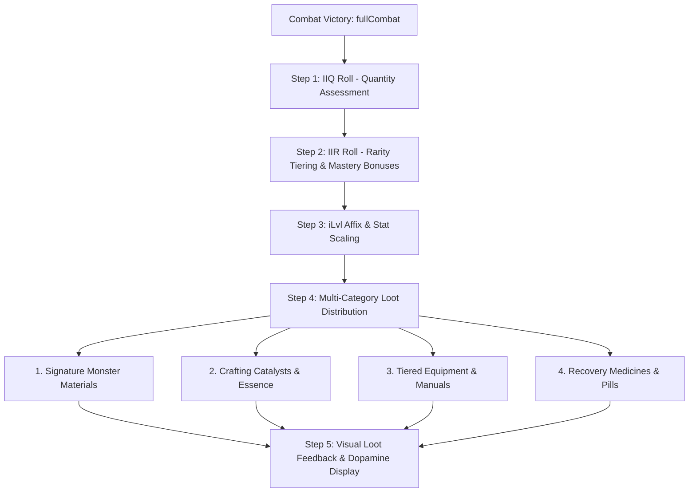

# Nghịch Thiên Ký — Game Difficulty & Loot Drop Pipeline Specification
*Reference Standard: MDG Hardcore ARPG Systems Architecture*

---

## 1. Executive Summary

This specification establishes the overhauled combat difficulty mechanics and the 5-step loot distribution pipeline for *Nghịch Thiên Ký*. By adopting proven numerical models from the MDG reference architecture (`combat_formulas_and_mitigation_design.md` and `loot_and_item_drop_system_design.md`), this system removes fragile 1-shot monster designs, balances armor mitigation dynamically against varying hit magnitudes, applies realm gap suppression, and introduces high-dopamine multi-category loot explosions.

---

## 2. Combat Difficulty & Mitigation Overhaul

### 2.1. Dynamic Armor Mitigation vs. Flat Reduction

Previously, physical defense used a flat curve $DR = \frac{\text{Def}}{\text{Def} + 100}$ independent of incoming damage. This resulted in low-level entities taking negligible damage while high-tier boss strikes were disproportionately reduced.

Following MDG Standard Section 2.1, defense now functions as **Dynamic Armor Mitigation** scaled inversely by raw damage magnitude:

$$\text{Armor Reduction (\%)} = \min\left(85.0\%, \frac{\text{Armor}}{\text{Armor} + 5 \times \max(8.0, \text{RawDamage})} \times 100\%\right)$$

* **Low-impact hits** (trash mobs, DoT ticks) are heavily mitigated by armor.
* **Heavy boss strikes** pierce through moderate armor, preserving danger and encouraging HP/defense investment and manual evasion/stance switching.
* **Capped at 85%** to ensure every hit transmits at least baseline chip damage.

### 2.2. Realm & Level Gap Suppression (Áp Chế Cảnh Giới)

To simulate cultivation tier suppression, incoming and outgoing damage factors the level disparity between combatants via `StatEngine::calcLevelSuppression($attackerLevel, $defenderLevel)`:

* **Attacker Under-leveled ($L_A < L_D$):** Damage suppressed by up to $-35\%$ ($-5\%$ per level difference, floor $0.65\times$).
* **Attacker Over-leveled ($L_A > L_D$):** Minor advantage up to $+20\%$ ($+3\%$ per level difference, ceiling $1.20\times$).

### 2.3. Hit & Evasion Resolution (Pacing Harmonization)

To eliminate artificial 25-turn stalemates caused by compounded hit and dodge misses:
* **Accuracy / Hit Rate:** $\text{Hit Chance} = \min\left(95\%, \max\left(20\%, 60\% + \frac{\text{Speed} + 1}{\text{Speed} + \text{Dex}} \times 35\%\right)\right)$.
* **Evasion / Dodge Rate:** $\text{Dodge Chance} = \min\left(35\%, \frac{\text{Dex}}{\text{Dex} + 2.5 \times \text{Speed}} \times 100\%\right)$.

---

## 3. Monster Tier Stat Floors & Level Scaling

To guarantee meaningful encounters and prevent 1-hit kills on entry-level creatures, minimum stat floors are enforced per cultivation tier prior to level scaling:

| Monster Tier | Cultivation Realm | Minimum HP Floor | Minimum STR Floor | Min DEF Floor | Level Scaling Rate | Boss Multiplier |
| :--- | :--- | :--- | :--- | :--- | :--- | :--- |
| **Tier 1** | Luyện Khí | 65 HP | 8 STR | 4 DEF | $+20\%$ HP, $+15\%$ STR / lvl | $\times 2.2$ HP / $\times 1.4$ STR |
| **Tier 2** | Trúc Cơ | 220 HP | 18 STR | 8 DEF | $+20\%$ HP, $+15\%$ STR / lvl | $\times 2.2$ HP / $\times 1.4$ STR |
| **Tier 3** | Kim Đan | 650 HP | 35 STR | 16 DEF | $+20\%$ HP, $+15\%$ STR / lvl | $\times 2.2$ HP / $\times 1.4$ STR |
| **Tier 4** | Nguyên Anh | 1,800 HP | 65 STR | 30 DEF | $+20\%$ HP, $+15\%$ STR / lvl | $\times 2.2$ HP / $\times 1.4$ STR |
| **Tier 5** | Hóa Thần+ | 5,000 HP | 120 STR | 60 DEF | $+20\%$ HP, $+15\%$ STR / lvl | $\times 2.2$ HP / $\times 1.4$ STR |

*Boss recognition is derived from `isBoss`, `boss`, `tags` containing `"boss"`, or monsters level $\ge 15$.*

---

## 4. The 5-Step MDG Loot Distribution Pipeline

### 4.1. Step 1: IIQ (Item Quantity)
* Normal Mobs: 1-2 distinct drop rolls.
* Tracked / Elite Mobs: 2-3 distinct drop rolls.
* Bosses / Secret Realm Guardians: **Loot Explosion** triggering 3-6 categorized rewards simultaneously.

### 4.2. Step 2: IIR (Item Rarity)
Rarity rolls (`common` $\to$ `uncommon` $\to$ `rare` $\to$ `epic` $\to$ `legendary`) are factored by:
* Monster Tier and Boss flag (Bosses guarantee `rare`, `epic`, or `legendary`).
* Player's **Monster Mastery** drop bonus percentage (`+15%` drop bonus at Tier 3+).

### 4.3. Step 3: iLvl (Item Level Scaling)
Generated equipment (`ItemSystem::generateRandomItem`) dynamically scales affixes and base numbers according to the monster's canonical level.

### 4.4. Step 4: Multi-Category Pools
1. **Signature Drops:** Harvested directly from `monsters.json` (e.g., `mat_thit_tho`, `mat_da_tho`, `mat_rang_soi_vuong`).
2. **Crafting Catalysts:** Tinh Thạch (`mat_tinh_thach`), Kim Loại Linh (`mat_kim_loai_linh`), Đá Cường Hóa (`da_cuong_hoa`), Tinh Hỏa (`mat_tinh_hoa`).
3. **Equipment & Manuals:** Randomly rolled weapons, armor, shields, or manual skill scrolls.
4. **Alchemical Pills:** Tẩy Tủy Đan, Hoàn Cốt Đan, Huyết Tinh.

### 4.5. Step 5: Visual Feedback & Dopamine Tiering
Combat results render a structured loot panel on the UI (`frontend/src/pages/combat.js`) color-coded according to ARPG dopamine tiers:
* 🌟 **Legendary:** Amber (`#f59e0b`)
* 🌟 **Epic:** Royal Purple (`#a855f7`)
* ⚔️ **Rare:** Gold (`#facc15`)
* 💎 **Uncommon / Catalyst:** Sky Blue (`#38bdf8`) / Emerald (`#10b981`)
* 📦 **Material / Common:** Jade (`#34d399`) / Slate (`#94a3b8`)
