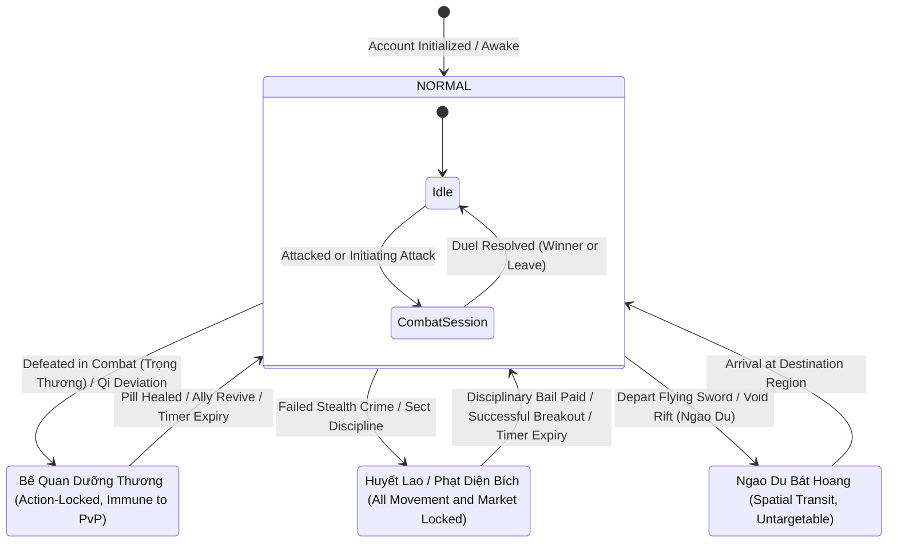
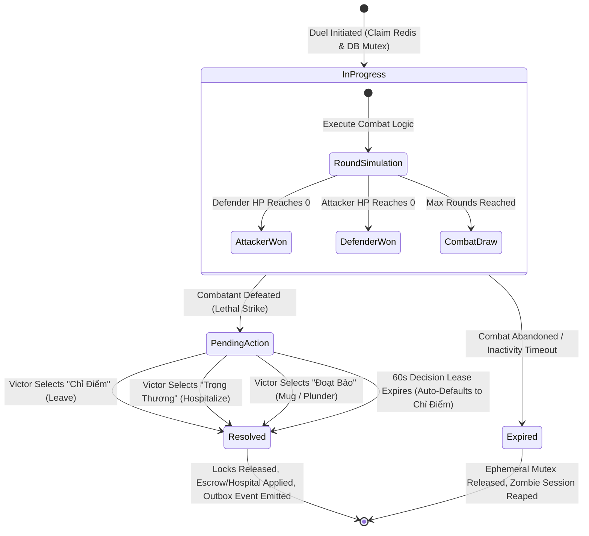
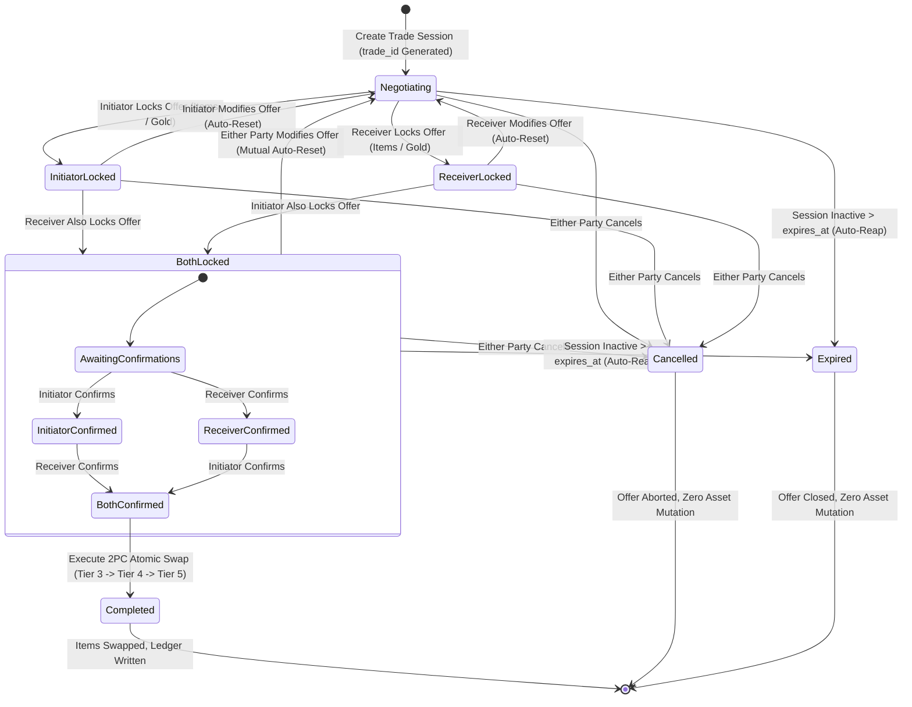
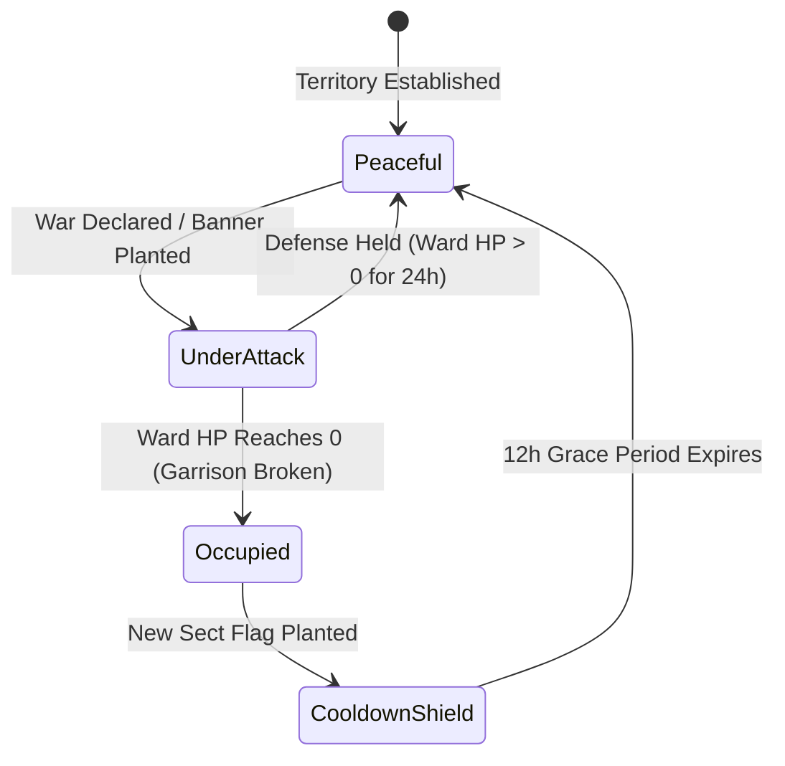

# Nghịch Thiên Ký — Persistent Multiplayer Architecture & Torn Systems Specification

**Project**: Nghịch Thiên Ký RPG Engine (逆天记 / Ni Tian Ji)  
**System**: High-Concurrency Persistent Multiplayer Subsystem  
**Author**: Master Technical Author & System Architect (`worker_spec_writer`)  
**Date**: 2026-09-26  
**Document Version**: 1.0.0-PROD  
**Status**: Authoritative Technical Specification & Production Architecture Blueprint  
**Target Specification File**: `docs/MULTIPLAYER_ARCHITECTURE_SPEC.md`  

---

## Directive Compliance & Architectural Mandate

This specification adheres strictly to the core engineering directive:
> **"Phân tích kiến thức thôi k copy nguyên qua nghe"**  
> *(Analyze foundational principles, domain knowledge, and architectural lessons only — DO NOT blindly copy or transplant external systems/code as-is).*  
> **"For LitePlatform: evaluate architectural patterns and libraries conceptually for relevance and lightweight fit, rather than dumping heavy unwanted dependencies."**

Every gameplay mechanic, mathematical model, concurrency pattern, and database schema in this document is derived by extracting the core game theory and failure post-mortems of persistent browser-based MMORPGs (notably Torn City) and re-architecting them natively into the Daoist Xianxia / Tu Tiên cosmology of *Nghịch Thiên Ký*.

---

## Master Table of Contents

1. [Executive Summary, Design Philosophy & Torn Retrospective](#1-executive-summary-design-philosophy--torn-retrospective)
   - 1.1 The Triad of Stakes in Persistent Web MMORPGs (Time, Wealth, Progression)
   - 1.2 Transmutation Matrix: Torn City to Xianxia / Tu Tiên Cosmology
   - 1.3 Torn City Retrospective: In-Depth "WHY and HOW" Post-Mortem Analysis
2. [Pillar 1: Core PvP Gameplay Loop & Player State Machine (R1)](#2-pillar-1-core-pvp-gameplay-loop--player-state-machine-r1)
   - 2.1 Formal 4-State Machine (FSM) & Invariants
   - 2.2 State Transition Matrix & Lockout Semantics
   - 2.3 Recovery Mechanisms & Intervention Channels (Pills, Ally Revives, Prison Bail & Breakout)
   - 2.4 The Post-Combat Outcome Trifecta (Chỉ Điểm, Trọng Thương, Đoạt Bảo)
   - 2.5 Mathematical Model: Mug Plunder with Logarithmic Anti-Grief Curves
   - 2.6 Mathematical Model: Dynamic Hospital Lockout Duration
   - 2.7 Tick Economics & Vitals: Dual-Resource Regeneration, Tâm Cảnh Multiplier & Đan Độc Saturation
3. [Pillar 2: High-Concurrency Architecture & Race Condition Elimination (R2)](#3-pillar-2-high-concurrency-architecture--race-condition-elimination-r2)
   - 3.1 Concurrency Hazard Taxonomy: Simultaneous Assault, Bazaar Sniping & P2P Swapping
   - 3.2 Transaction Safety & Locking Hierarchy (MySQL InnoDB Row Locking & OCC)
   - 3.3 Deadlock Elimination via Deterministic Lexicographical Total Ordering & Global Resource DAG
   - 3.4 Formal Transaction Algorithms & Mathematical Invariant Proofs
   - 3.5 Real-Time Event Streaming Topology: Deep Comparative Evaluation & Hybrid Architecture
4. [Pillar 3: Tông Môn (Factions) & Territory Warfare (R3)](#4-pillar-3-tông-môn-factions--territory-warfare-r3)
   - 4.1 Chuỗi Liên Trảm (Chaining): Dynamic Countdown Timers & Scaling Multipliers
   - 4.2 Territory Warfare: Linh Mạch Tranh Đoạt (Spiritual Veins & Garrison Siege)
   - 4.3 Faction Governance, Hierarchical RBAC & Multi-Signature Treasury Protocol
5. [Pillar 4: Macro-Economy, P2P Phường Thị & Anti-Exploit Ecosystem (R4)](#5-pillar-4-macro-economy-p2p-phường-thị--anti-exploit-ecosystem-r4)
   - 5.1 Macro-Economic Equilibrium: Faucets vs Multi-Tier Sinks
   - 5.2 Anti-Alt & Anti-Pushover Algorithmic Detection Matrix
   - 5.3 High-Velocity Rate Limiting & Non-Intrusive Bot Mitigation
6. [Pillar 5: Technical Architecture Spec & LitePlatform Integration Blueprint (R5)](#6-pillar-5-technical-architecture-spec--liteplatform-integration-blueprint-r5)
   - 6.1 Complete Production-Ready MySQL 8.0+ / MariaDB 10.5+ DDL Schemas
   - 6.2 Entity-Relationship (ER) Architecture Diagram
   - 6.3 Exhaustive API Contract Specifications (REST & Real-Time WebSocket)
   - 6.4 LitePlatform Modular Integration Blueprint & 4-Phase Non-Breaking Roadmap
7. [Appendix: Verification Checklist & Traceability Matrix](#7-appendix-verification-checklist--traceability-matrix)

---

## 1. Executive Summary, Design Philosophy & Torn Retrospective

### 1.1 The Triad of Stakes in Persistent Web MMORPGs (Time, Wealth, Progression)

Persistent browser-based games (PBBGs) and text-centric MMORPGs achieve decades-long retention not through high-fidelity visual rendering, but through the mathematical gravity of their stakes. In contrast to single-player or instanced session games where death is erased by reloading a save file, a persistent shared world operates on irreversible opportunity cost:

```
                                  THE TRIAD OF STAKES
                               ┌─────────────────────────┐
                               │          TIME           │
                               │   (Opportunity Cost)    │
                               │  - Energy/Nerve Regens  │
                               │  - Hospital/Jail Locks  │
                               └────────────┬────────────┘
                                            │
                     Balancing Sinks        │       Strategic Conflict
                     & Decay Curves         │       & Territory Warfare
                                            │
            ┌───────────────────────────────┴───────────────────────────────┐
            │                                                               │
            ▼                                                               ▼
┌─────────────────────────┐                                   ┌─────────────────────────┐
│         WEALTH          │◄─────────────────────────────────►│       PROGRESSION       │
│    (Liquid Capital)     │       Economic Predation          │ (Compound Cultivation)  │
│ - Unbanked Linh Thạch   │       & Merchant Escrow           │ - Stat Multipliers      │
│ - Bazaar Speculation    │                                   │ - Faction Respect       │
└─────────────────────────┘                                   └─────────────────────────┘
```

1. **Time (Opportunity Cost)**: Actions require regenerated vitals (Thể Lực / Linh Lực). Time cannot be purchased infinitely. Forcing an opponent into action-lockout (Hospitalization / Bế Quan Dưỡng Thương or Jail / Huyết Lao) removes their agency in territory warfare, economic generation, and gym training.
2. **Wealth (Liquid Capital)**: Unbanked currency (*Linh Thạch*) carried in pocket inventory is vulnerable to open-world plunder (*Đoạt Bảo*). Greed and market speed create structural tension against safety and bank deposits.
3. **Progression (Compound Cultivation & Sect Standing)**: Stat compounding and sect prestige (*Uy Danh Tông Môn*) are zero-sum or high-friction competitive races. Defeating a cultivator is not merely a localized combat log; it tilts regional territory control and alters server-wide market balances.

---

### 1.2 Transmutation Matrix: Torn City to Xianxia / Tu Tiên Cosmology

To avoid discordant modern tropes in an ancient Daoist world, the structural mechanics of persistent MMORPGs are transmuted natively into classical Xianxia metaphysics:

| Persistent MMO / Torn Concept | Core Systemic Mechanism | Xianxia Adaptation in *Nghịch Thiên Ký* | Daoist Metaphysical Rationale |
| :--- | :--- | :--- | :--- |
| **Hospital** | Forced action-lockout penalty; medical recovery sink. | **Bế Quan Dưỡng Thương (Trọng Thương)** | Fractured meridians, shattered dantian; requires quiet meditation or high-grade medicinal pills to purge trauma. |
| **Jail** | Punishment for failed clandestine acts; bail currency sink. | **Huyết Lao / Phạt Diện Bích** | Righteous sect disciplinary cliff or demonic blood prison; requires repentance fines or daring stealth escape. |
| **Travel** | Time-locked regional transit; spatial price arbitrage. | **Ngao Du Bát Hoang** | Flying sword transit across desolate frontiers and void rifts; safe from terrestrial ambushes during void flight. |
| **Mug** | High-risk plunder of unbanked liquid cash. | **Đoạt Bảo (Đoạt Linh Thạch)** | Plundering heavenly treasures and loose spirit stones from a defeated rival on the wild cultivation road. |
| **Leave / Spar** | Pure XP cultivation; minimal victim incapacitation. | **Chỉ Điểm (Luận Đạo / Thiết Tha)** | Martial discourse; trading strikes to sharpen combat insights and dao heart without malice or bodily harm. |
| **Hospitalize** | Maximum victim lockout; tactical denial of agency. | **Phế Đi Tu Vi / Đánh Trọng Thương** | Ruthless martial suppression; crippling a rival cultivator to knock them out of territory node contests or chains. |
| **Happy** | Multiplier curve accelerating stat training gains. | **Tâm Cảnh (Đạo Tâm / Mindset)** | Spiritual serenity and dao heart clarity multiplying bodily tempering and breakthrough efficiency. |
| **Booster / Drug CD** | Temporary burst vs toxicity, addiction, and overdose. | **Đan Độc / Kinh Mạch Hạn Mức** | Pill impurities (*Đan Cấu*) accumulating in spiritual veins; overdose triggers catastrophic Qi Deviation (*Tẩu Hỏa Nhập Ma*). |
| **Faction Chaining** | Synchronized multi-player attack blitz under pressure. | **Chuỗi Liên Trảm (Vạn Tiên Trận)** | Coordinated sect assault where consecutive kills amplify sect morale and heavenly prestige before battle fervor dissipates. |
| **Territory War** | Static resource node occupation, defense, and yields. | **Linh Mạch Tranh Đoạt (Động Phủ)** | Sect warfare over spiritual veins; yields passive flows of raw spirit stones and celestial herbs to controlling sects. |
| **Multi-Sig Vault** | Protection against rogue officers and compromised accounts. | **Tàng Bảo Các (Trận Pháp Đồng Thuận)** | High-value treasury withdrawals locked behind dual-elder consensus seals and immutable jade tablet ledgers. |
| **Bazaar Tax** | Macro-economic deflationary currency sink. | **Phí Thuế Thương Hội Phường Thị** | Merchant guild commission burned from circulation to prevent runaway spirit stone hyper-inflation. |

---

### 1.3 Torn City Retrospective: In-Depth "WHY and HOW" Post-Mortem Analysis

Understanding why persistent systems failed historically in early text MMORPGs is mandatory to prevent repeating architectural vulnerabilities.

#### Case Study 1: The Buy-Mugging Epidemic & Market Sniping Bots
- **The Exploit**: In naive PBBG bazaars, selling an item instantly credited liquid currency into the seller's active wallet. Malicious players engineered automated bots utilizing low-latency API polling. Within 15ms of a high-value purchase (e.g., $50,000,000 cash), the bot initiated an attack on the seller, defeated them, and mugged up to 20% of the funds before the victim could physically click their banking interface.
- **Why Torn Struggled**: Torn relied on client-side alerts and manual banking. It required years of patchwork fixes (e.g., "Anonymous Bazaars", temporary mugging protection timers, and custom banking merits).
- **Architectural Solution in Nghịch Thiên Ký**:
  1. *Merchant Escrow Mailbox (Hộp Thư Thương Hội)*: Proceeds from Phường Thị market sales are **never** deposited into a cultivator's liquid wallet. They are routed into a secure merchant escrow vault. Cultivators claim funds on demand when in a verified safe state.
  2. *Divine Protection Ward (Càn Khôn Hộ Thể)*: Claiming high-value currency triggers a mandatory 90-second non-combat divine ward, completely preventing mugging attempts.
  3. *Zero-Latency Pessimistic Row Locking*: Combat initiation and market purchases run through isolated ACID transactions; simultaneous attack-and-buy race conditions fail fast with HTTP 409 Conflict.

#### Case Study 2: Hospital Holding & Invulnerability Turtling
- **The Exploit**: Because hospitalized players cannot be attacked, factions engaged in territory warfare realized that **being hospitalized was the ultimate defensive bunker**. Faction leaders ordered all 100 members to intentionally overdose on mild items or lose duels to friendly alts. Protected inside the hospital, they waited until an opposing faction's attack chain reached its final 30 seconds, consumed medical items to leave hospital for 5 seconds, landed a hit to break the opponent's momentum, and immediately turtled back into the hospital.
- **Why Torn Struggled**: Hospitalization was binary (safe vs unsafe) without medical fatigue or decay. Torn eventually patched this via hard Medical Cooldown caps and in-hospital mercenary hits.
- **Architectural Solution in Nghịch Thiên Ký**:
  1. *Strict Medical Cooldown Cap (1800s)*: Ingesting healing pills adds to `med_cooldown_until`. Once remaining cooldown reaches 1800 seconds (30 minutes), meridians reject all further medical intervention.
  2. *Truy Hồn Đoạt Mệnh (Soul Tracking Strike)*: During an active territory skirmish (*Linh Mạch Tranh Đoạt*), opposing sect elders can cast high-tier curses that strike garrisoned cultivators even inside their hospital recovery ward, dealing structural damage to the defending sect's barrier.
  3. *Meridian Atrophy (Khí Huyết Suy Thoái)*: Remaining hospitalized for longer than 60 minutes inflicts a 30-minute debuff upon release, reducing stamina regeneration by 50%.

#### Case Study 3: Ghost Factions & Level-1 Chain Dummy Farms
- **The Exploit**: Factions seeking top-tier respect multipliers required 10,000 consecutive combat hits. Rather than fighting real opponents who could retaliate and hospitalize attackers, factions created "Ghost Factions" populated by hundreds of unequipped Level-1 bot accounts. Faction members executed thousands of trivial hits with zero operational risk.
- **Why Torn Struggled**: Early chain formulas awarded flat respect per hit regardless of target strength. Torn spent years overhauling the formula into the complex "Fair Fight Multiplier" (FFM).
- **Architectural Solution in Nghịch Thiên Ký**:
  1. *Fair Fight Multiplier (FFM)*: Respect yields scale strictly with the stat ratio:
     $$\text{FFM} = \text{clamp}\left(0.1, \, 3.0, \, 1.0 + \frac{\text{Stats}_{\text{defender}} - \text{Stats}_{\text{attacker}}}{\text{Stats}_{\text{attacker}}}\right)$$
     Hitting a dummy account with negligible stats yields $\text{FFM} = 0.1\times$, reducing respect gain to near zero ($0.01$) and extending the chain countdown by only 5 seconds instead of the full timer.
  2. *Active Cultivator Invariant*: To qualify for chain progression, the defender must have performed an active transaction or login within the preceding 7 days. Inactive or dormant accounts are excluded from chain credit.

#### Case Study 4: Asymmetric P2P Trade Swapping
- **The Exploit**: In asynchronous P2P trading windows, player $A$ offers 1,000,000 gold for player $B$'s rare artifact. Player $B$ inspects the window and clicks "Accept". In the final millisecond before $A$ clicks accept, $A$ sends a rapid packet swapping 1,000,000 gold to 10,000 gold and confirms. If the system does not reset $B$'s confirmation state, $B$ is defrauded.
- **Architectural Solution in Nghịch Thiên Ký**:
  1. *Stateful Two-Phase Commit (2PC) Trade FSM*: The trade progresses through strict states: `negotiating` $\to$ `both_locked` $\to$ `both_confirmed` $\to$ `completed`.
  2. *Mutual Auto-Invalidation Invariant*: Any mutation to offered items, quantities, or currency automatically revokes both players' locked and confirmed flags, reverting the session to `negotiating`.
  3. *Deterministic Lexicographical Resource Locking*: The final atomic swap locks both players' rows in alphabetical UUID order, re-verifying inventory slot capacity and liquid balances before committing.

---

## 2. Pillar 1: Core PvP Gameplay Loop & Player State Machine (R1)

### 2.1 Formal 4-State Machine (FSM) & Invariants

A cultivator entity in *Nghịch Thiên Ký* exists in exactly one primary persistent state at any given millisecond. The state machine is governed by 4 mutually exclusive states:



#### State Invariants & Semantics

1. **`NORMAL` (Tự Do / Xuất Thế)**:
   - *Invariants*: `hospital_until <= NOW()`, `jail_until <= NOW()`, `travel_until <= NOW()`.
   - *Semantics*: Fully actionable. May train in gym, cultivate, participate in arena duels, explore secret realms, buy/sell on Phường Thị, initiate attacks, or be attacked.
2. **`HOSPITALIZED` (Trọng Thương / Bế Quan Dưỡng Thương)**:
   - *Invariants*: `hospital_until > NOW()`.
   - *Semantics*: Incapacitated due to severed spiritual meridians or physical combat trauma.
   - *Lockouts*: Cannot initiate attacks, train stats, cultivate, travel, or explore secret realms.
   - *Immunity*: **Cannot be attacked by open-world players** (prevents infinite death-loops).
   - *Permitted Actions*: Ingest healing pills (*Đan Dược*), accept ally healing, access personal stash, view market, chat.
3. **`IMPRISONED` (Huyết Lao / Phạt Diện Bích)**:
   - *Invariants*: `jail_until > NOW()`.
   - *Semantics*: Detained at the Sect Disciplinary Cliff or Blood Prison following a critical failure in stealth crimes.
   - *Lockouts*: Cannot train, cultivate, explore, attack, travel, or access the external marketplace.
   - *Immunity*: Cannot be attacked via open-world PvP.
   - *Permitted Actions*: Attempt stealth breakout (*Vượt Ngục*), pay disciplinary bail (*Nộp Phạt Chuộc Thân*), petition sect master.
4. **`TRAVELING` (Ngao Du Bát Hoang)**:
   - *Invariants*: `travel_until > NOW()`, `travel_dest_id IS NOT NULL`.
   - *Semantics*: In transit across void fractures or flying sword routes between the 18 geographic realms.
   - *Lockouts*: Regional actions (local gym, regional dungeons, local bazaar) locked.
   - *Immunity*: **Untargetable from both origin and destination realms** until arrival.
   - *Permitted Actions*: View global channels, manage inventory, view character profile.

---

### 2.2 State Transition Matrix & Lockout Semantics

| State | Initiate PvP? | Defend PvP? | Gym Training? | Cultivate? | Travel? | Phường Thị Trade? | Ingest Healing Pill? |
| :--- | :---: | :---: | :---: | :---: | :---: | :---: | :---: |
| **NORMAL** | **Yes** | **Yes** | **Yes** | **Yes** | **Yes** | **Yes** | **Yes** |
| **HOSPITALIZED** | **No** | **No** | **No** | **No** | **No** | View Only | **Yes** (Healing only) |
| **IMPRISONED** | **No** | **No** | **No** | **No** | **No** | **No** | **No** |
| **TRAVELING** | **No** | **No** | **No** | **No** | In Progress | **No** | **Yes** (Self-buffs) |

#### ACID Transition Mutex Rule
Every transition between states (e.g., from `NORMAL` to `HOSPITALIZED`) MUST be executed inside an ACID transaction utilizing row-level pessimistic locking (`SELECT ... FOR UPDATE` on `player_states`). This eliminates race conditions where two attackers knock out the same target simultaneously or where a target departs on a travel route at the exact millisecond an attack lands.

---

### 2.3 Recovery Mechanisms & Intervention Channels

#### 1. Medical Consumables (Đan Dược Trị Thương)
Cultivators ingest specialized pills to accelerate recovery from `HOSPITALIZED` status:
- Each pill reduces remaining hospital duration: $\Delta t_{\text{hosp}} = -R_{\text{pill}}$.
- To prevent infinite instant-revive spamming during territory wars, every pill adds to a **Medical Cooldown (`med_cooldown_until`)**:
  $$\text{Cooldown Added} = C_{\text{pill}} \times (1 + \text{Toxicity\_Modifier})$$
- **Hard Cap**: The medical cooldown cap is bounded at **1800 seconds (30 minutes)**. If `med_cooldown_until - NOW() >= 1800`, meridians cannot tolerate further medicine, and no additional pills may be ingested until the cooldown decays below the cap.

#### 2. Ally Healing (Diệu Thủ Hồi Xuân)
Allies or sect physicians can visit a hospitalized cultivator to infuse spiritual Qi:
- Costs the healer **25 Thể Lực (Stamina)** and requires an equipped healing talisman or high *Thần Nông Thuật* proficiency.
- Reduces victim hospital time by 50% or revives them immediately if hospital time $< 120\text{s}$.
- Both the healer and the recipient incur a 15-minute ally-healing fatigue timer to prevent bot-network revive rings.

#### 3. Jail Breakout & Bail (Vượt Ngục & Nộp Phạt Chuộc Thân)
For `IMPRISONED` status:
- **Bail (Nộp Phạt Chuộc Thân)**: Instant release by paying a progressive fine of Spirit Stones to the Disciplinary Hall:
  $$\text{Bail Cost} = B_{\text{base}} \times (\text{Jail\_Remaining\_Minutes})^{1.15} \times (\text{Realm\_Tier})^{1.5}$$
  *(Where $B_{\text{base}} = 500$ Linh Thạch. Serves as a mandatory progressive deflationary sink).*
- **Breakout (Vượt Ngục)**: A high-risk stealth check based on *Thân Pháp (Dexterity)* and *Khí Thần (Nerve)*:
  $$P(\text{Escape}) = \text{clamp}\left(15\%, \, 75\%, \, 50\% + \frac{\text{Dexterity}_{\text{player}} - \text{Perception}_{\text{guard}}}{\text{Perception}_{\text{guard}}} \times 30\%\right)$$
  - *Success*: Restores `NORMAL` state immediately, but tags the player with a "Wanted / Truy Nã" debuff for 60 minutes (bounty target for other cultivators).
  - *Failure*: Critical punishment: `jail_until` is doubled (+100% time penalty) and 10% maximum Qi is drained.

---

### 2.4 The Post-Combat Outcome Trifecta (Chỉ Điểm, Trọng Thương, Đoạt Bảo)

#### Combat Session Finite-State Machine (FSM)



When player $A$ defeats player $B$ in open-world combat, $A$ must select one of three mutually exclusive tactical outcomes within a 60-second action window:

```
                             ┌─────────────────────────────────┐
                             │       VICTORY IN COMBAT         │
                             └────────────────┬────────────────┘
                                              │
         ┌────────────────────────────────────┼────────────────────────────────────┐
         │                                    │                                    │
         ▼                                    ▼                                    ▼
┌──────────────────┐                ┌──────────────────┐                ┌──────────────────┐
│     CHỈ ĐIỂM     │                │   TRỌNG THƯƠNG   │                │     ĐOẠT BẢO     │
│   (Spar / Leave) │                │  (Hospitalize)   │                │   (Mug / Rob)    │
├──────────────────┤                ├──────────────────┤                ├──────────────────┤
│ Cultivation XP:  │                │ Cultivation XP:  │                │ Cultivation XP:  │
│ ★★★★★ (100%)     │                │ ★★☆☆☆ (40%)      │                │ ★☆☆☆☆ (20%)      │
│                  │                │                  │                │                  │
│ Victim Lockout:  │                │ Victim Lockout:  │                │ Victim Lockout:  │
│ 30 - 60 seconds  │                │ 600 - 3600 secs  │                │ 120 - 300 secs   │
│                  │                │                  │                │                  │
│ Plunder:         │                │ Plunder:         │                │ Plunder:         │
│ 0 Linh Thạch     │                │ 0 Linh Thạch     │                │ 4% - 18% Liquid  │
│                  │                │                  │                │ Unbanked Stones  │
│ Strategic Value: │                │ Strategic Value: │                │ Strategic Value: │
│ Fast progression │                │ Faction warfare, │                │ Direct economic  │
│ & low malice     │                │ territory denial │                │ wealth transfer  │
└──────────────────┘                └──────────────────┘                └──────────────────┘
```

1. **Chỉ Điểm (Spar / Leave)**:
   - *Lore*: *"Luận đạo kết thúc, thu kiếm vào bao"* — Attacker honors martial conduct, sparing the opponent.
   - *Attacker Gain*: 100% Cultivation XP, maximum weapon proficiency, and $+1$ Tâm Cảnh.
   - *Victim Impact*: Minimal injury; hospitalized for only **30 to 60 seconds** to stabilize Qi.
   - *Design Goal*: The optimal route for peaceful leveling, gym training chains, and non-toxic gameplay.
2. **Trọng Thương (Hospitalize / Phế Đi Tu Vi)**:
   - *Lore*: *"Xuất thủ tàn độc, đoạn tuyệt kinh mạch"* — Attacker strikes a crippling blow, fracturing meridians.
   - *Attacker Gain*: 40% Cultivation XP, zero gold plunder.
   - *Victim Impact*: Severe lockout (**10 to 60 minutes**, scaled by realm tier and overkill).
   - *Design Goal*: Crucial tactical weapon during **Tông Môn Territory Wars** to remove rival defenders.
3. **Đoạt Bảo (Mug / Plunder)**:
   - *Lore*: *"Sát nhân đoạt bảo, tịch thu càn khôn"* — Attacker loots loose spirit stones from the victim's pouch.
   - *Attacker Gain*: Plunders an algorithmic fraction (4% to 18%) of victim's **unbanked liquid Linh Thạch**; 20% Cultivation XP.
   - *Victim Impact*: Moderate lockout (**2 to 5 minutes**), loss of unbanked currency.
   - *Design Goal*: High-stakes economic predation, strictly regulated by anti-grief decay curves.

---

### 2.5 Mathematical Model: Mug Plunder with Logarithmic Anti-Grief Curves

#### Why Flat Percentage Mugging Fails
In naive systems, $\text{Loot} = W \times \text{UniformRandom}(0.05, 0.15)$. This leads to:
1. *Hyper-Wealth Exploitation*: An account with 100,000,000 Linh Thạch loses 15,000,000 in one hit.
2. *Grief-Farming*: A cabal of high-level players repeatedly attacks a victim every 5 minutes, draining their net worth to zero.
3. *Mug-Bot Sniping*: Automated bots scan market logs and mug sellers within 50ms of a transaction.

#### The Robust Xianxia Plunder Model

Let:
- $W$: Victim's current unbanked liquid Linh Thạch ($W \ge 0$).
- $S_{\text{att}}$: Attacker's *Cướp Bóc (Larceny)* talent tier ($1 \le S_{\text{att}} \le 10$).
- $N_{\text{mug}}$: Total successful mugs against this victim within rolling $\Delta T = 4 \text{ hours}$ (by *any* player).
- $t_{\text{last}}$: Seconds elapsed since victim was last mugged.
- $\text{Realm\_Tier}$: Cultivation realm tier of victim ($1$ for Luyện Khí to $5$ for Hóa Thần).

##### 1. Base Plunder Rate ($P_{\text{base}}$)
The base percentage scales inversely with the victim's total liquid wealth bracket:
$$P_{\text{base}}(W) = \text{clamp}\left(4\%, \, 18\%, \, 18\% - 3.5\% \times \log_{10}\left(\max\left(1, \, \frac{W}{10{,}000}\right)\right)\right)$$
- If $W = 10{,}000$: $P_{\text{base}} = 18.0\%$
- If $W = 100{,}000$: $P_{\text{base}} = 14.5\%$
- If $W = 1{,}000{,}000$: $P_{\text{base}} = 11.0\%$
- If $W = 10{,}000{,}000$: $P_{\text{base}} = 7.5\%$
- If $W \ge 100{,}000{,}000$: $P_{\text{base}} = 4.0\%$ (soft bottom floor)

##### 2. Attacker Skill Modifier ($F_{\text{skill}}$)
$$F_{\text{skill}} = 1.0 + 0.05 \times (S_{\text{att}} - 1) \quad (\text{Range: } 1.00 \text{ to } 1.45)$$

##### 3. Victim Anti-Grief Recency Decay Multiplier ($D_{\text{grief}}$)
Every mug against the victim within 4 hours severely suppresses plunder yields across the entire server. To prevent zero-yield anomalies on freshly active or previously unattacked players (where $t_{\text{last}} = 0$ or `last_mugged_at` is uninitialized), $D_{\text{grief}}$ is explicitly defined as a piecewise decay function:

$$D_{\text{grief}}(N_{\text{mug}}, t_{\text{last}}) = \begin{cases}
1.0 & \text{if } N_{\text{mug}} = 0 \text{ (victim unmugged in rolling 4h window or initial state)} \\
\frac{1}{1 + 0.85 \times N_{\text{mug}}} \times \left(1 - \exp\left(-\frac{t_{\text{last}}}{1800}\right)\right) & \text{if } N_{\text{mug}} \ge 1
\end{cases}$$

- *Properties & Edge Case Resolution*:
  - **Unattacked Initial State ($N_{\text{mug}} = 0$)**: Yields $D_{\text{grief}} \equiv 1.0$ (100% yield). Even if `last_mugged_at` is initialized to 0 or NULL in database records, unmugged cultivators always yield their full algorithmic plunder percentage.
  - **Repeat Attack Within 4 Hours ($N_{\text{mug}} \ge 1$)**:
    - If victim was mugged 3 times already ($N_{\text{mug}} = 3$): $\frac{1}{1 + 0.85 \times 3} = 0.281$ (maximum 28.1% ceiling).
    - If victim was mugged 5 minutes ago ($t_{\text{last}} = 300\text{s}$, $N_{\text{mug}} = 1$): $\frac{1}{1.85} \times \left(1 - \exp\left(-\frac{300}{1800}\right)\right) = 0.541 \times 0.1535 \approx 0.083$ (yield crushed down to $\approx 8.3\%$).
    - If victim was mugged 1 minute ago ($t_{\text{last}} = 60\text{s}$, $N_{\text{mug}} = 2$): $\frac{1}{2.70} \times \left(1 - \exp\left(-\frac{60}{1800}\right)\right) = 0.370 \times 0.0328 \approx 1.21\%$ (virtually zero yield, eradicating automated mug-bot farming).

##### 4. Final Plunder Calculation
$$\text{Loot}(W) = \min\left(M_{\text{cap}}, \, \left\lfloor W \times P_{\text{base}}(W) \times F_{\text{skill}} \times D_{\text{grief}} \times \text{UniformRandom}(0.9, 1.1) \right\rfloor\right)$$
Where $M_{\text{cap}} = 500{,}000 \times \text{Realm\_Tier}_{\text{victim}}$ is the absolute ceiling on any single mug transaction.

---

### 2.6 Mathematical Model: Dynamic Hospital Lockout Duration

When **Trọng Thương (Hospitalize)** is selected or when an attacker is knocked out defensively, the victim's lockout duration ($T_{\text{hosp}}$, in seconds) is dynamically computed:

$$T_{\text{hosp}} = \text{clamp}\left(T_{\text{min}}(\text{outcome}), \, T_{\text{max}}(\text{outcome}), \, T_{\text{base}} \times M_{\text{realm}} \times M_{\text{overkill}} \times M_{\text{delta}}\right)$$

#### Parameter Definitions
1. **$T_{\text{base}}$ (Base Duration)**:
   - For `Trọng Thương` victory: $1800\text{s}$ (30 minutes).
   - For `Đoạt Bảo` victory: $180\text{s}$ (3 minutes).
   - For `Chỉ Điểm` victory: $45\text{s}$ (uniform random $30 - 60\text{s}$).
   - For Attacker Loss (countered and knocked out): $300\text{s}$ (5 minutes).
2. **$M_{\text{realm}}$ (Realm Tier Multiplier)**:
   Higher cultivation realms possess deeper dantians; reconstructing them requires longer meditation:
   $$M_{\text{realm}} = 1.0 + 0.15 \times (\text{Realm\_Tier}_{\text{victim}} - 1)$$
   - Luyện Khí (Tier 1): $1.0\times$ | Trúc Cơ (Tier 2): $1.15\times$ | Kim Đan (Tier 3): $1.30\times$ | Nguyên Anh (Tier 4): $1.45\times$ | Hóa Thần (Tier 5): $1.60\times$.
3. **$M_{\text{overkill}}$ (Excess Trauma Multiplier)**:
   Calculated from final lethal strike damage exceeding remaining HP:
   $$M_{\text{overkill}} = \text{clamp}\left(1.0, \, 1.5, \, 1.0 + \frac{\text{LethalDamage} - \text{RemainingHp}}{\text{MaxHp}_{\text{victim}}}\right)$$
4. **$M_{\text{delta}}$ (Level Disparity Compensation)**:
   Protects lower-level cultivators from predatory high-level bullies:
   $$\Delta L = \text{Level}_{\text{attacker}} - \text{Level}_{\text{victim}}$$
   $$M_{\text{delta}} = \begin{cases} 
   \max\left(0.5, \, 1.0 - 0.03 \times \Delta L\right) & \text{if } \Delta L > 0 \text{ (High level attacking low level)} \\
   \min\left(1.75, \, 1.0 + 0.05 \times |\Delta L|\right) & \text{if } \Delta L < 0 \text{ (Underdog defeating giant)}
   \end{cases}$$
5. **Outcome Clamping Bounds $[T_{\text{min}}, T_{\text{max}}]$**:
   To guarantee deterministic game balance and prevent level-delta extremes from breaking outcome invariants, clamping bounds are strictly partitioned per combat resolution outcome:

| Combat Resolution Outcome | Target Entity | $T_{\text{base}}$ | $T_{\text{min}}$ (Floor) | $T_{\text{max}}$ (Ceiling) | Tactical & Balance Purpose |
| :--- | :--- | :---: | :---: | :---: | :--- |
| **Trọng Thương (Hospitalize)** | Defender | $1800\text{s}$ (30m) | **$600\text{s}$ (10m)** | **$3600\text{s}$ (60m)** | Incapacitates enemy combatant in territory wars and faction blitz chains. |
| **Đoạt Bảo (Mug / Plunder)** | Defender | $180\text{s}$ (3m) | **$120\text{s}$ (2m)** | **$300\text{s}$ (5m)** | Concussion state; victim recovers quickly while attacker gains window to bank loot. |
| **Chỉ Điểm (Spar / Leave)** | Defender | $45\text{s}$ (45s) | **$30\text{s}$ (30s)** | **$60\text{s}$ (60s)** | Honorable martial exchange; minimal recovery without incurring clinical burdens. |
| **Attacker Loss (Countered)** | Attacker | $300\text{s}$ (5m) | **$150\text{s}$ (2.5m)** | **$600\text{s}$ (10m)** | Attacker knocked unconscious upon counter-defeat; enforces high assault risk. |

---

### 2.7 Tick Economics & Vitals: Dual-Resource Regeneration, Tâm Cảnh Multiplier & Đan Độc Saturation

#### 1. Dual-Resource Engine (Thể Lực vs Linh Lực)
*Nghịch Thiên Ký* strictly separates physical bodily exertion from spiritual dao manipulation:

| Resource Dimension | Thể Lực (World Stamina) | Linh Lực (Spiritual Energy) |
| :--- | :--- | :--- |
| **Metaphysical Domain** | Physical body, corporeal exertion | Mystical dao, spiritual aura manipulation |
| **Primary Consumption** | Gym training, manual labor, travel, crimes | PvP combat sessions, secret realm rifts, auras |
| **Base Pool & Scaling** | Base Cap: 100 (scales via Body Tempering) | Base Cap: 50 (scales $+15$ per Realm Tier) |
| **Natural Regen Rate** | 5 units per 5-minute tick ($1.0 / \text{min}$) | 5 units per 15-minute tick ($0.33 / \text{min}$) |
| **Replenishment Items** | Rations, spirit springs, body pills | Meditation, Spirit Veins, Qi gathering pills |

#### Epoch-Modulo Global Clock (Zero-Overhead Scaling)
Instead of scheduling millions of database updates via background cron workers, the engine computes resource regeneration lazily upon request:
$$\text{CurrentTick}_{\text{stamina}} = \left\lfloor \frac{\text{UNIX\_TIME}}{300} \right\rfloor, \quad \text{CurrentTick}_{\text{energy}} = \left\lfloor \frac{\text{UNIX\_TIME}}{900} \right\rfloor$$
$$\Delta \text{Ticks} = \text{CurrentTick} - \text{player.last\_tick}$$
$$\text{player.currentVal} = \min(\text{player.maxVal}, \, \text{player.currentVal} + \Delta \text{Ticks} \times \text{RegenRate})$$
$$\text{player.last\_tick} = \text{CurrentTick}$$
*Scalability Guarantee*: 500,000 inactive accounts consume **0 database IOPS** during tick boundaries.

#### 2. Tâm Cảnh (Dao Heart / Mindset): The Cultivation Multiplier
Tâm Cảnh represents spiritual serenity and freedom from inner demons (*Tâm Ma*), functioning as the multiplier for Gym training gains:

```
Tâm Cảnh Value Range: 0 to 10,000
├── 0 - 999:       Tâm Ma Loạn Khí (-50% training gain, 2x breakthrough failure)
├── 1,000 - 4,999: Bình Thường (1.0x baseline training gain)
├── 5,000 - 9,999: Thanh Tịnh (1.25x - 1.75x training gain)
└── 10,000+:       Đốn Ngộ (Sudden Enlightenment / "Happy Jump": 5.0x gain)
```

##### Stat Training Formula with Tâm Cảnh
When training Strength, Speed, Dexterity, or Defense in the Gym (*Võ Đường*):
$$\Delta \text{Stat} = \text{TalentMultiplier} \times \left(1.0 + \frac{\text{Tâm\_Cảnh}}{2{,}500}\right) \times \left(\frac{\text{StaminaSpent}}{5}\right)$$
- Baseline ($\text{Tâm\_Cảnh} = 1{,}000$): Multiplier $= 1.4\times$
- High Cave Dwelling ($\text{Tâm\_Cảnh} = 5{,}000$): Multiplier $= 3.0\times$
- Sudden Enlightenment ($\text{Tâm\_Cảnh} = 10{,}000$): Multiplier $= 5.0\times$

##### Decay & Trauma Rules
1. *Natural Regression*: Every 15 minutes, if $\text{Tâm\_Cảnh} > \text{Base\_Cave\_Dwelling}$, excess decays by **7% per tick**:
   $$\text{Tâm\_Cảnh}(t + 1) = \text{Base} + (\text{Tâm\_Cảnh}(t) - \text{Base}) \times (1 - 0.07)$$
2. *Combat Shock*: Being mugged drops Tâm Cảnh by **15%**; being hospitalized drops it by **30%**. Sparring (*Chỉ Điểm*) inflicts zero trauma.

#### 3. Đan Độc (Meridian Toxicity) & Tẩu Hỏa Nhập Ma (Overdose Model)
Pills contain celestial essence contaminated by earth impurities (*Đan Cấu*). Ingesting pills without purifying meridians clogs spiritual channels and risks catastrophic Qi Deviation:

```
[ INGEST MEDICINE / BOOSTER ]
              │
              ▼
   + Toxicity Points (TP)
   + Medical Cooldown (MC)
              │
              ▼
 ┌───────────────────────────┐
 │ Check Total Toxicity (TP) │
 └─────────────┬─────────────┘
               │
   ┌───────────┼───────────┬───────────────┬───────────────────────┐
   ▼           ▼           ▼               ▼                       ▼
TP < 25     25 ≤ TP < 50  50 ≤ TP < 80    80 ≤ TP < 100           TP ≥ 100
[Thanh Khiết] [Vi Vi Độc]   [Nhiễm Độc]     [NGUY CẤP]              [TẨU HỎA NHẬP MA]
Normal      -10% Stamina  -25% Stats      60% - 98% Overdose      100% Guaranteed Overdose:
            Regen         Breakthrough    Stochastic Risk         Hospitalized 8 hours,
                          Forbidden                               All Energy/Stamina wiped,
                                                                  Tâm Cảnh crushed to 0.
```

- **Toxicity Points (TP)**: Each pill adds 5 to 30 TP.
- **Passive Decay**: Decays at **1 TP per 10 minutes** of uninterrupted rest or meditation.
- **Active Cleansing**: Burning cleansing herbs (*Thanh Tâm Đan*) or bathing in sect spirit springs purges TP, generating an active trade loop for herbalists.
- **Overdose Probability**: Ingesting medicine while $\text{TP} \ge 60$ triggers a stochastic Qi Deviation check:
  $$P(\text{Tẩu\_Hỏa}) = \frac{\text{TP} - 50}{50} \times 100\%$$
  - At $\text{TP} < 60$: $P = 0\%$ (Safe zone, only stat debuffs apply).
  - At $\text{TP} = 60$: $P = 20\%$ (Initial breach risk).
  - At $\text{TP} = 80$: $P = 60\%$ (Severe toxicity gamble).
  - At $\text{TP} = 99$: $P = 98\%$ (Near-certain meridian failure).
  - At $\text{TP} \ge 100$: $P = 100\%$ (Catastrophic meridian rupture, guaranteed 8-hour hospitalization).

---

## 3. Pillar 2: High-Concurrency Architecture & Race Condition Elimination (R2)

### 3.1 Concurrency Hazard Taxonomy: Simultaneous Assault, Bazaar Sniping & P2P Swapping

```
                      CONCURRENCY HAZARD MATRIX
┌──────────────────────┬─────────────────────────────┬─────────────────────────────┐
│ Hazard Scenario      │ Mechanism of Failure        │ Architectural Resolution    │
├──────────────────────┼─────────────────────────────┼─────────────────────────────┤
│ Simultaneous Assault │ Parallel combat simulations │ Fail-Fast Mutex Lockout     │
│                      │ on stale defender snapshot  │ (`active_combat_session_id`)│
├──────────────────────┼─────────────────────────────┼─────────────────────────────┤
│ Bazaar Sniping       │ Read-Modify-Write race on   │ Pessimistic Row Lock        │
│                      │ stock and buyer/seller gold │ (`SELECT ... FOR UPDATE`)   │
├──────────────────────┼─────────────────────────────┼─────────────────────────────┤
│ P2P Trade Swapping   │ In-flight offer swapping &  │ Stateful 2PC Handshake with │
│                      │ inventory slot overflow     │ Auto-Reset & Slot Check     │
└──────────────────────┴─────────────────────────────┴─────────────────────────────┘
```

#### 1. Simultaneous Assault: Gang Attack vs Fail-Fast Mutex Lockout
In an uncoordinated architecture, if Attackers $A_1$ and $A_2$ strike Defender $D$ at timestamp $t_0$, both read $D$'s healthy snapshot, both run independent damage calculations, and both steal gold. If $D$ holds 80,000 Linh Thạch, two concurrent 75,000-stone mugs drive $D$'s balance to $-70,000$ or duplicate currency.

- **Queuing vs Lockout Trade-off**:
  - *Queuing (FIFO Buffer)*: Queuing $A_2$ behind $A_1$ forces $A_2$ to wait 60s, only to execute against a defender who is already unconscious in the hospital ($HP = 0$). This creates phantom energy loss and client confusion.
  - *Fail-Fast Mutex Lockout (Adopted)*: An atomic lock is claimed on Defender $D$. If $D$ is locked or engaged, $A_2$ is immediately rejected ($< 20\text{ms}$) with HTTP 409 Conflict: `{"error": "TARGET_ENGAGED", "message": "Đối thủ đang giao chiến với người khác!"}`.

#### 2. Bazaar (Phường Thị) Sniping: Double-Spending & Phantom Stock
When an underpriced item is listed, dozens of automated snipers submit buy requests simultaneously. Under standard MySQL MVCC snapshot reads, multiple transactions read `quantity = 1`, all pass validation, decrement stock to negative values, and duplicate the item across multiple inventories.

#### 3. Direct P2P Trading: Asynchronous Item Swapping & Slot Overflow
Player $A$ places 1,000,000 gold; Player $B$ places an epic sword. Player $B$ confirms. At the split second before $A$ confirms, $A$ swaps 1,000,000 for 10,000. If confirmations are not invalidated atomically, $B$ is defrauded. Furthermore, if $B$'s inventory fills up during negotiation, the transaction can drop items into the void.

---

### 3.2 Transaction Safety & Locking Hierarchy (MySQL InnoDB Row Locking & OCC)

```
                     ACID TRANSACTION BOUNDARY & LOCKING DAG
┌─────────────────────────────────────────────────────────────────┐
│ 1. START TRANSACTION (Isolation: REPEATABLE READ)              │
│ 2. SET innodb_lock_wait_timeout = 3                             │
│ 3. ACQUIRE LOCKS STRICTLY ALIGNED TO GLOBAL RESOURCE DAG:       │
│    ├── Tier 2: Lock bazaar_listings row (Primary Key only)      │
│    ├── Tier 3: Lock Player Wallets / States in Lexico Order     │
│    │            ├── Lock min(buyerId, sellerId)                 │
│    │            └── Lock max(buyerId, sellerId)                 │
│    └── Tier 4: Lock / Check Inventories (player_items)          │
│ 4. Perform Invariant Checks (Stock >= Qty, Gold >= Cost, Slots) │
│ 5. Execute Mutations (UPDATE listings, UPDATE wallets/escrow)   │
│ 6. INSERT Double-Entry Audit Ledger Row (Tier 5)                │
│ 7. COMMIT                                                       │
└─────────────────────────────────────────────────────────────────┘
```

#### InnoDB Lock Mechanics: Preventing Gap Lock Contention
- When executing `SELECT ... FOR UPDATE WHERE id = :id`:
  - If `id` is a **Primary Key**, InnoDB acquires an exclusive **Record Lock**. No gap locks are generated.
  - If querying on a non-unique index (e.g., `WHERE seller_id = :seller_id`), InnoDB places **Next-Key Locks** (locking the record and the entire gap before it), inducing catastrophic blocking and phantom deadlocks under high concurrency.
  - **Rule**: All `SELECT ... FOR UPDATE` queries in *Nghịch Thiên Ký* MUST filter strictly by Primary Key (`WHERE id = :id` or `WHERE listing_id = :listing_id` or `WHERE item_uid IN (...)`).

#### Optimistic Concurrency Control (OCC) vs Pessimistic Locking
For low-contention operations (character stat allocation, equipment equipping, quest turn-in), pessimistic locking induces unnecessary latency. We employ monotonic version columns:
$$\text{UPDATE players SET stats} = :newStats, version = version + 1 \text{ WHERE id} = :id \text{ AND } version = :expectedVersion$$
If $\text{RowsAffected} = 0$, an OCC conflict occurred, prompting the client to re-fetch and retry.

---

### 3.3 Deadlock Elimination via Deterministic Lexicographical Total Ordering & Global Resource DAG

When multiple entities and tables must be locked within a single transaction (PvP combat initiation, Bazaar checkout, P2P trading, Faction treasury), circular wait deadlocks ($T_1: A \to B$ while $T_2: B \to A$) can crash database threads if locking sequences diverge.

#### 1. Global Multi-Table Resource Locking DAG
To prevent cross-table deadlocks between different operations (e.g. buyer acquiring listing then wallet vs seller cancelling listing while holding wallet), the database engine mandates a **Global Resource Class Total Order**:

$$\text{Tier 0 (Mutexes)} \prec \text{Tier 1 (Factions)} \prec \text{Tier 2 (Market / Sessions)} \prec \text{Tier 3 (Players / Wallets)} \prec \text{Tier 4 (Inventories)} \prec \text{Tier 5 (Ledgers)}$$

```
                   GLOBAL CROSS-TABLE RESOURCE LOCKING DAG
┌────────────────────────────────────────────────────────────────────────┐
│ Tier 0: Headers / Ephemeral Distributed Mutexes                        │
│         - Redis SETNX Leases: mutex:pvp_target:{id}, mutex:bazaar:{id} │
└───────────────────────────────────┬────────────────────────────────────┘
                                    │
                                    ▼
┌────────────────────────────────────────────────────────────────────────┐
│ Tier 1: Factions (Tông Môn)                                            │
│         - Locked via: SELECT ... FROM factions WHERE faction_id = :id  │
└───────────────────────────────────┬────────────────────────────────────┘
                                    │
                                    ▼
┌────────────────────────────────────────────────────────────────────────┐
│ Tier 2: Market Listings & Session Headers                              │
│         - bazaar_listings (listing_id), trade_offers (trade_id),       │
│           pvp_combat_sessions (session_id)                             │
└───────────────────────────────────┬────────────────────────────────────┘
                                    │
                                    ▼
┌────────────────────────────────────────────────────────────────────────┐
│ Tier 3: Players, Wallets & Persistent States                           │
│         - players, player_states                                       │
│         - Intra-Tier Rule: Sorted in Ascending Lexicographical Order   │
│           ID_(1) <_lex ID_(2) <_lex ... <_lex ID_(k)                   │
└───────────────────────────────────┬────────────────────────────────────┘
                                    │
                                    ▼
┌────────────────────────────────────────────────────────────────────────┐
│ Tier 4: Inventories & Equipment Instances                              │
│         - player_items (locked by PK id or item_uid in sorted order)   │
└───────────────────────────────────┬────────────────────────────────────┘
                                    │
                                    ▼
┌────────────────────────────────────────────────────────────────────────┐
│ Tier 5: Audit & Event Ledgers (Append-Only)                            │
│         - wallet_audit_ledger (INSERT only, never SELECT FOR UPDATE)   │
└────────────────────────────────────────────────────────────────────────┘
```

#### 2. Intra-Tier Lexicographical Total Ordering Rule
For any set of entity IDs within the same table tier (e.g. multiple player wallets in PvP duel or P2P trade offers $\{ID_1, ID_2, \dots, ID_n\}$), row locks MUST be acquired in ascending lexicographical order:
$$ID_{(1)} <_{\text{lex}} ID_{(2)} <_{\text{lex}} \dots <_{\text{lex}} ID_{(n)} \quad (\text{lexicographical string comparison})$$

#### 3. Mathematical Proof of Global Deadlock Freedom
Let graph $G = (V, E)$ represent resource lock allocations across the entire database, where vertices $V$ represent resource instances $(Tier_k, EntityID_i)$ and directed edges $(u, v) \in E$ represent an active transaction holding lock $u$ and requesting lock $v$.

1. Define a composite ordering relation $\prec_{\text{global}}$ over all database resources:
   $$(Tier_A, ID_A) \prec_{\text{global}} (Tier_B, ID_B) \iff Tier_A < Tier_B \lor (Tier_A = Tier_B \land ID_A <_{\text{lex}} ID_B)$$
2. Since both standard integer order ($<$) and string lexicographical order ($<_{\text{lex}}$) are strict total orders, their lexicographical product $\prec_{\text{global}}$ is also a **strict total order** (irreflexive, transitive, and total).
3. Under the Global Resource DAG Protocol, a transaction holding resource $u$ can request resource $v$ if and only if $u \prec_{\text{global}} v$.
4. Suppose by contradiction that there exists a deadlock. By Coffman's conditions, a deadlock requires a directed circular dependency cycle:
   $$R_1 \prec_{\text{global}} R_2 \prec_{\text{global}} \dots \prec_{\text{global}} R_m \prec_{\text{global}} R_1$$
5. By transitivity of $\prec_{\text{global}}$, $R_1 \prec_{\text{global}} R_m \prec_{\text{global}} R_1 \implies R_1 \prec_{\text{global}} R_1$, which contradicts the irreflexivity of a strict total order ($R \not\prec_{\text{global}} R$).
6. Hence, the resource dependency graph $G$ is strictly a **Directed Acyclic Graph (DAG)** with a valid topological sorting.
7. The probability of circular wait deadlock across all intra-table and cross-table multi-resource operations is **identically 0**.

---

### 3.4 Formal Transaction Algorithms & Mathematical Invariant Proofs

#### Algorithm 1: Atomic Bazaar Purchase (Zero Double-Spending & Zero Phantom Stock)

```
ALGORITHM: ExecuteAtomicBazaarBuy
INPUT:     buyerId (UUID), listingId (BIGINT), buyQuantity (INT), clientExpectedPrice (BIGINT)
OUTPUT:    PurchaseResult (SUCCESS / FAILED)

1:  SET SESSION TRANSACTION ISOLATION LEVEL REPEATABLE READ;
2:  START TRANSACTION;
3:  SET innodb_lock_wait_timeout = 3;

4:  // 1. Fetch & lock bazaar listing by Primary Key (Tier 2 in Global DAG)
5:  SELECT listing_id, seller_id, item_id, item_data, quantity, unit_price, status 
6:  FROM bazaar_listings 
7:  WHERE listing_id = :listingId 
8:  FOR UPDATE;

9:  IF listing DOES NOT EXIST OR listing.status != 'active' THEN
10:     ROLLBACK;
11:     RETURN { status: 404, error: "ERR_LISTING_EXHAUSTED" };
12: END IF;

13: IF listing.quantity < buyQuantity THEN
14:     ROLLBACK;
15:     RETURN { status: 409, error: "ERR_INSUFFICIENT_STOCK", available: listing.quantity };
16: END IF;

17: IF listing.unit_price != clientExpectedPrice THEN
18:     ROLLBACK;
19:     RETURN { status: 409, error: "ERR_PRICE_CHANGED", currentPrice: listing.unit_price };
20: END IF;

21: totalCost = listing.unit_price * buyQuantity;
22: sellerId  = listing.seller_id;

23: IF buyerId == sellerId THEN
24:     ROLLBACK;
25:     RETURN { status: 422, error: "ERR_BUY_SELF_LISTING" };
26: END IF;

27: // 2. Lock Buyer & Seller Wallets/States in Deterministic Lexicographical Order (Tier 3 in Global DAG)
28: sortedIds = SORT_STRINGS([buyerId, sellerId]);
29: FOREACH uid IN sortedIds:
30:     SELECT id, gold FROM players WHERE id = uid FOR UPDATE;
31:     SELECT player_id, pending_escrow FROM player_states WHERE player_id = uid FOR UPDATE;
32: END FOREACH;
33: 
34: buyerGold = GET_LOCKED_PLAYER_GOLD(buyerId);
35: IF buyerGold < totalCost THEN
36:     ROLLBACK;
37:     RETURN { status: 422, error: "ERR_INSUFFICIENT_FUNDS", required: totalCost, balance: buyerGold };
38: END IF;
39: 
40: // 3. Unpack Item Metadata & Verify Buyer Inventory Capacity (Tier 4 in Global DAG)
41: itemMeta   = PARSE_JSON(listing.item_data);
42: freeSlots  = GET_FREE_SLOTS(buyerId);
43: isStack    = (itemMeta.stackable == TRUE OR itemMeta.stackable == 1);
44: stackRowId = NULL;
45: 
46: IF isStack THEN
47:     existingStack = SELECT id, quantity FROM player_items 
48:                     WHERE player_id = buyerId AND item_uid = listing.item_id 
49:                     LIMIT 1 FOR UPDATE;
50:     IF existingStack IS NOT NULL THEN
51:         stackRowId = existingStack.id;
52:     ELSE IF freeSlots < 1 THEN
53:         ROLLBACK;
54:         RETURN { status: 422, error: "ERR_INVENTORY_FULL", message: "Hành trang đã đầy!" };
55:     END IF;
56: ELSE
57:     IF freeSlots < buyQuantity THEN
58:         ROLLBACK;
59:         RETURN { status: 422, error: "ERR_INVENTORY_FULL", message: "Hành trang không đủ chỗ trống!" };
60:     END IF;
61: END IF;
62: 
63: // 4. Progressive Tax Calculation (Bazaar Sink) & Atomic State Updates
64: taxRate        = GET_PROGRESSIVE_TAX_RATE(totalCost);
65: feeAmount      = FLOOR(totalCost * taxRate);
66: sellerProceeds = totalCost - feeAmount;
67: 
68: // Balance updates (Seller credited to Escrow Mailbox to prevent Buy-Mugging)
69: UPDATE players SET gold = gold - totalCost WHERE id = buyerId;
70: UPDATE player_states SET pending_escrow = pending_escrow + sellerProceeds WHERE player_id = sellerId;
71: 
72: // Decrement Stock or Mark Sold
73: remainingStock = listing.quantity - buyQuantity;
74: IF remainingStock == 0 THEN
75:     UPDATE bazaar_listings 
76:     SET quantity = 0, status = 'sold_out', version = version + 1 
77:     WHERE listing_id = :listingId;
78: ELSE
79:     UPDATE bazaar_listings 
80:     SET quantity = remainingStock, version = version + 1 
81:     WHERE listing_id = :listingId;
82: END IF;
83: 
84: // Transfer Item into Buyer Inventory (Tier 4 in Global DAG)
85: IF stackRowId IS NOT NULL THEN
86:     UPDATE player_items SET quantity = quantity + buyQuantity WHERE id = stackRowId;
87: ELSE
88:     INSERT INTO player_items (player_id, item_uid, name, base_type, slot, rarity, item_level, category, quantity, sell_price, stackable, affixes)
89:     VALUES (buyerId, UUID(), itemMeta.name, itemMeta.base_type, itemMeta.slot, itemMeta.rarity, itemMeta.item_level, itemMeta.category, buyQuantity, listing.unit_price, isStack, itemMeta.affixes);
90: END IF;
91: 
92: // 5. Record Double-Entry Audit Ledger Row (Tier 5 in Global DAG)
93: INSERT INTO wallet_audit_ledger (source_id, dest_id, gross_amount, tax_amount, net_amount, reference_type, reference_id)
94: VALUES (buyerId, sellerId, totalCost, feeAmount, sellerProceeds, 'bazaar_buy', listingId);
95: 
96: COMMIT;
97: // 6. Broadcast Outbox Event via Redis Pub/Sub
98: REDIS_PUBLISH("channel:user:" + sellerId, { event: "bazaar.item_sold", listingId: listingId, net: sellerProceeds });
99: RETURN { status: 200, success: true, message: "Purchase completed successfully." };
```

#### Invariant Verification Proof for Algorithm 1:
- **Zero Phantom Stock**: The listing row is locked exclusively via `FOR UPDATE` prior to checking `quantity < buyQuantity` (Tier 2 lock). Any concurrent buyer blocks until commit. If stock hits 0, `status` becomes `sold_out`. All subsequent buyers immediately read `quantity = 0` or `status != 'active'` and abort cleanly.
- **Zero Double-Spending & Strict DAG Monotonicity**: Buyer & seller wallets and states are locked in deterministic lexicographical order at Tier 3 prior to inspecting or locking Tier 4 inventory rows. If `buyerGold < totalCost`, the transaction rolls back. The database-level `CHECK (gold >= 0)` constraint prevents balances from dipping below zero under any edge condition.
- **Anti-Buy-Mugging Protection**: Market proceeds are routed into the seller's secure `pending_escrow` vault in `player_states`, preventing predatory bots from mugging the seller's liquid wallet immediately after a sale.
- **Inventory Slot Integrity**: Checking `freeSlots` and locking/updating `player_items` strictly at Tier 4 (after Tier 3 locks are acquired) prevents bag overflow beyond defined slot limits while maintaining total acyclicity against concurrent P2P trade operations.
- **Conserved Value Invariant**:
  $$\Delta \text{Gold}_{\text{buyer}} + \Delta \text{Escrow}_{\text{seller}} + \text{TaxFee} = (-C) + (C - \text{Fee}) + \text{Fee} \equiv 0$$
  Zero currency is created from thin air; exactly $\text{Fee}$ is permanently burned.

---

#### Algorithm 2: Atomic PvP Duel Initiation & Target State Lockout

```
ALGORITHM: InitiatePvPCombatSession
INPUT:     attackerId (UUID), defenderId (UUID)
OUTPUT:    SessionInitResult (SUCCESS / FAILED)

1:  IF attackerId == defenderId THEN
2:      RETURN { status: 400, error: "ERR_CANNOT_ATTACK_SELF" };
3:  END IF;

4:  now = CURRENT_UNIX_TIMESTAMP();

5:  // 1. Acquire Distributed Redis Mutex to absorb Thundering Herd attacks (Tier 0 in Global DAG)
6:  mutexKey = "mutex:pvp_target:" + defenderId;
7:  token    = GENERATE_SECURE_TOKEN();
8:  IF NOT REDIS_SET(mutexKey, token, "NX", "PX", 2500) THEN
9:      RETURN { status: 409, error: "ERR_TARGET_IN_COMBAT", message: "Mục tiêu đang bị tấn công!" };
10: END IF;

11: TRY:
12:     START TRANSACTION;
13:     SET innodb_lock_wait_timeout = 2;

14:     // 2. Lock Attacker and Defender in Lexicographical Order (Tier 3 in Global DAG)
15:     [firstId, secondId] = SORT_STRINGS([attackerId, defenderId]);
16:     SELECT player_id, status, hospital_until, jail_until, travel_until, active_combat_session_id, version 
17:     FROM player_states 
18:     WHERE player_id IN (firstId, secondId) 
19:     ORDER BY player_id ASC 
20:     FOR UPDATE;

21:     attackerState = GET_LOCKED_STATE(attackerId);
22:     defenderState = GET_LOCKED_STATE(defenderId);

23:     // 3. Null Checks for Non-Existent Entities
24:     IF attackerState IS NULL THEN
25:         ABORT_WITH("ERR_ATTACKER_NOT_FOUND");
26:     END IF;
27:     IF defenderState IS NULL THEN
28:         ABORT_WITH("ERR_TARGET_NOT_FOUND");
29:     END IF;

30:     // 4. Zombie Session Reaper (Non-Locking Snapshot Read - Eliminates Backwards Tier 2 Lock while holding Tier 3)
31:     FOREACH state IN [attackerState, defenderState]:
32:         IF state.active_combat_session_id IS NOT NULL THEN
33:             // Non-locking snapshot read (Tier 2 read without FOR UPDATE)
34:             sess = SELECT status, action_expires_at FROM pvp_combat_sessions 
35:                    WHERE session_id = state.active_combat_session_id;
36:             IF sess IS NOT NULL AND sess.action_expires_at >= now THEN
37:                 IF state.player_id == attackerId THEN
38:                     ABORT_WITH("ERR_ATTACKER_ALREADY_IN_SESSION");
39:                 ELSE
40:                     ABORT_WITH("ERR_TARGET_IN_COMBAT");
41:                 END IF;
42:             ELSE IF sess IS NOT NULL AND sess.action_expires_at < now THEN
43:                 // Victor lease expired without resolving; mark abandoned and release locks
44:                 UPDATE pvp_combat_sessions 
45:                 SET status = 'expired', outcome = 'abandoned', resolved_at = NOW() 
46:                 WHERE session_id = state.active_combat_session_id AND status = 'in_progress';
47:                 UPDATE player_states 
48:                 SET active_combat_session_id = NULL, version = version + 1 
49:                 WHERE active_combat_session_id = state.active_combat_session_id;
50:                 state.active_combat_session_id = NULL;
51:             END IF;
52:         END IF;
53:     END FOREACH;

54:     // 5. Attacker Status Validation
55:     IF attackerState.hospital_until > now OR attackerState.status != 'normal' THEN
56:         ABORT_WITH("ERR_PLAYER_ACTION_LOCKED");
57:     END IF;
58:     IF attackerState.active_combat_session_id IS NOT NULL THEN
59:         ABORT_WITH("ERR_ATTACKER_ALREADY_IN_SESSION");
60:     END IF;

61:     // 6. Defender Status Validation (Hospitalized, Jailed, Traveling, or in Combat)
62:     IF defenderState.hospital_until > now OR defenderState.status == 'hospitalized' THEN
63:         ABORT_WITH("ERR_TARGET_HOSPITALIZED");
64:     END IF;
65:     IF defenderState.jail_until > now OR defenderState.status == 'jailed' THEN
66:         ABORT_WITH("ERR_TARGET_JAILED", "Đối thủ đang bị giam cầm trong Huyết Lao!");
67:     END IF;
68:     IF defenderState.travel_until > now OR defenderState.status == 'traveling' THEN
69:         ABORT_WITH("ERR_TARGET_TRAVELING");
70:     END IF;
71:     IF defenderState.active_combat_session_id IS NOT NULL THEN
72:         ABORT_WITH("ERR_TARGET_IN_COMBAT");
73:     END IF;

74:     // 7. Create Active Combat Session (Tier 2 in Global DAG)
75:     sessionId = GENERATE_UUID();
76:     actionExpiresAt = now + 60; // 60s lease for victor action
77:     INSERT INTO pvp_combat_sessions (session_id, attacker_id, defender_id, status, action_expires_at, started_at)
78:     VALUES (sessionId, attackerId, defenderId, 'in_progress', actionExpiresAt, NOW());

79:     // 8. Update Player States with Session Mutex Lock
80:     UPDATE player_states SET active_combat_session_id = sessionId, version = version + 1 WHERE player_id = attackerId;
81:     UPDATE player_states SET active_combat_session_id = sessionId, version = version + 1 WHERE player_id = defenderId;

82:     COMMIT;
83:     // 9. Broadcast Real-Time Alert to Defender
84:     REDIS_PUBLISH("channel:user:" + defenderId, { event: "combat.incoming", sessionId: sessionId, attackerId: attackerId });

85:     RETURN { status: 200, success: true, sessionId: sessionId };

86: FINALLY:
87:     // Ephemeral Redis mutex released safely; DB row locks now protect session
88:     REDIS_EVAL_SAFE_RELEASE(mutexKey, token);
```

---

#### Algorithm 2b: Atomic PvP Combat Resolution (Phase 2 Post-Combat Action)

```
ALGORITHM: ResolvePvPCombatAction
INPUT:     sessionId (UUID), victorId (UUID), actionChosen (ENUM: 'leave', 'wound', 'rob')
OUTPUT:    ActionResult (SUCCESS / FAILED)

1:  SET SESSION TRANSACTION ISOLATION LEVEL REPEATABLE READ;
2:  START TRANSACTION;
3:  SET innodb_lock_wait_timeout = 3;
4:  now = CURRENT_UNIX_TIMESTAMP();

5:  // 1. Lock Combat Session Row (Tier 2 in Global DAG)
6:  SELECT session_id, attacker_id, defender_id, status, outcome, action_expires_at 
7:  FROM pvp_combat_sessions 
8:  WHERE session_id = :sessionId 
9:  FOR UPDATE;

10: IF session DOES NOT EXIST THEN
11:     ROLLBACK;
12:     RETURN { status: 404, error: "ERR_SESSION_NOT_FOUND" };
13: END IF;

14: IF session.status != 'pending_action' THEN
15:     ROLLBACK;
16:     RETURN { status: 409, error: "ERR_ACTION_ALREADY_COMMITTED" };
17: END IF;

18: // Auto-resolve to 'leave' (Chỉ Điểm) if 60-second lease expired
19: IF session.action_expires_at < now THEN
20:     actionChosen = 'leave';
21: END IF;

22: IF victorId != session.attacker_id AND victorId != session.defender_id THEN
23:     ROLLBACK;
24:     RETURN { status: 403, error: "ERR_UNAUTHORIZED_COMBATANT" };
25: END IF;

26: attackerId = session.attacker_id;
27: defenderId = session.defender_id;
28: loserId    = (victorId == attackerId) ? defenderId : attackerId;

29: // 2. Lock Both Combatant Wallets & States in Lexicographical Order (Tier 3 in Global DAG)
30: sortedIds = SORT_STRINGS([attackerId, defenderId]);
31: FOREACH uid IN sortedIds:
32:     SELECT id, gold FROM players WHERE id = uid FOR UPDATE;
33:     SELECT player_id, status, hospital_until, active_combat_session_id, version FROM player_states WHERE player_id = uid FOR UPDATE;
34: END FOREACH;

35: lootStolen   = 0;
36: hospDuration = 0;

37: // 3. Execute Selected Action Logic
38: SWITCH actionChosen:
39:     CASE 'leave': // Chỉ Điểm (Leave / Martial Sparring)
40:         hospDuration = CLAMP(30, 60, COMPUTE_HOSPITAL_TIME(45, loserId, victorId));
41:         AWARD_CULTIVATION_XP(victorId, 100);
42:         BREAK;

43:     CASE 'wound': // Trọng Thương (Hospitalize)
44:         hospDuration = CLAMP(600, 3600, COMPUTE_HOSPITAL_TIME(1800, loserId, victorId));
45:         AWARD_FACTION_RESPECT_AND_CHAIN(victorId, loserId);
46:         BREAK;

47:     CASE 'rob':   // Đoạt Bảo (Mug / Plunder)
48:         loserGold  = GET_LOCKED_PLAYER_GOLD(loserId);
49:         lootStolen = COMPUTE_MUG_PLUNDER(loserGold, loserId, victorId);
50:         IF lootStolen > 0 THEN
51:             UPDATE players SET gold = gold - lootStolen WHERE id = loserId;
52:             UPDATE players SET gold = gold + lootStolen WHERE id = victorId;
53:             // Tier 5: Record double-entry ledger entry
54:             INSERT INTO wallet_audit_ledger (source_id, dest_id, gross_amount, tax_amount, net_amount, reference_type, reference_id)
55:             VALUES (loserId, victorId, lootStolen, 0, lootStolen, 'pvp_mug', sessionId);
56:         END IF;
57:         hospDuration = CLAMP(120, 300, COMPUTE_HOSPITAL_TIME(180, loserId, victorId));
58:         AWARD_FACTION_RESPECT_AND_CHAIN(victorId, loserId);
59:         BREAK;
60: END SWITCH;

61: // 4. Apply Hospitalization Lockout to Defeated Combatant
62: UPDATE player_states 
63: SET status = 'hospitalized', hospital_until = now + hospDuration, version = version + 1 
64: WHERE player_id = loserId;

65: // 5. Release Mutual Combat Session Mutex Lock
66: UPDATE player_states 
67: SET active_combat_session_id = NULL, version = version + 1 
68: WHERE player_id IN (attackerId, defenderId);

69: // 6. Finalize Combat Session Status
70: UPDATE pvp_combat_sessions 
71: SET status = 'resolved', action_chosen = actionChosen, loot_stolen = lootStolen, resolved_at = NOW() 
72: WHERE session_id = :sessionId;

73: COMMIT;

74: // 7. Publish Real-Time Event Telemetry
75: REDIS_PUBLISH("channel:user:" + attackerId, { event: "combat.resolved", sessionId: sessionId, action: actionChosen, loot: lootStolen });
76: REDIS_PUBLISH("channel:user:" + defenderId, { event: "combat.resolved", sessionId: sessionId, action: actionChosen, hospitalSeconds: hospDuration });
77: RETURN { status: 200, success: true, action: actionChosen, lootStolen: lootStolen, hospitalDuration: hospDuration };
```

---

#### P2P Trade Negotiation Finite-State Machine (FSM)



#### Algorithm 3: P2P Two-Phase Commit Trade Handshake

```
ALGORITHM: CommitP2PTradeOffer
INPUT:     tradeId (UUID), callingPlayerId (UUID), expectedVersion (INT)
OUTPUT:    CommitResult (SUCCESS / FAILED)

1:  SET SESSION TRANSACTION ISOLATION LEVEL REPEATABLE READ;
2:  START TRANSACTION;
3:  SET innodb_lock_wait_timeout = 3;

4:  // 1. Lock Trade Offer Row by Primary Key (Tier 2 in Global DAG)
5:  SELECT * FROM trade_offers WHERE trade_id = :tradeId FOR UPDATE;

6:  IF trade DOES NOT EXIST OR trade.status NOT IN ('both_locked') THEN
7:      ROLLBACK;
8:      RETURN { status: 409, error: "ERR_TRADE_NOT_LOCKED" };
9:  END IF;

10: IF trade.version != expectedVersion THEN
11:     ROLLBACK;
12:     RETURN { status: 409, error: "ERR_TRADE_OFFER_CHANGED" };
13: END IF;

14: IF trade.initiator_id == trade.receiver_id THEN
15:     ROLLBACK;
16:     RETURN { status: 422, error: "ERR_TRADE_SELF", message: "Không thể giao dịch với chính mình!" };
17: END IF;

18: // 2. Mark Calling Player Confirmed
19: IF callingPlayerId == trade.initiator_id THEN
20:     trade.initiator_confirmed = 1;
21: ELSE IF callingPlayerId == trade.receiver_id THEN
22:     trade.receiver_confirmed = 1;
23: END IF;

24: // 3. If only one player confirmed, persist and await partner
25: IF NOT (trade.initiator_confirmed == 1 AND trade.receiver_confirmed == 1) THEN
26:     UPDATE trade_offers 
27:     SET initiator_confirmed = trade.initiator_confirmed, 
28:         receiver_confirmed  = trade.receiver_confirmed, 
29:         version = version + 1 
30:     WHERE trade_id = :tradeId;
31:     COMMIT;
32:     RETURN { status: 200, success: true, status: "pending_partner_confirmation" };
33: END IF;

34: // 4. Both Confirmed: Lock Wallets in Deterministic Lexicographical Order (Tier 3 in Global DAG)
35: [firstId, secondId] = SORT_STRINGS([trade.initiator_id, trade.receiver_id]);
36: FOREACH uid IN [firstId, secondId]:
37:     SELECT id, gold FROM players WHERE id = uid FOR UPDATE;
38: END FOREACH;

39: // 5. Lock Traded Item Instances in Deterministic UID Order (Tier 4 in Global DAG)
40: allOfferedUids = EXTRACT_ALL_ITEM_UIDS(trade.initiator_items, trade.receiver_items);
41: sortedItemUids = SORT_STRINGS(allOfferedUids);
42: IF LENGTH(sortedItemUids) > 0 THEN
43:     SELECT id, player_id, item_uid 
44:     FROM player_items 
45:     WHERE item_uid IN (sortedItemUids) 
46:     ORDER BY item_uid ASC 
47:     FOR UPDATE;
48: END IF;

49: // 6. Verify Exact Item Ownership & Availability (Anti-Front-Running)
50: FOREACH itemUid IN trade.initiator_items:
51:     IF NOT ITEM_BELONGS_TO(itemUid, trade.initiator_id) THEN
52:         ROLLBACK;
53:         RETURN { status: 409, error: "ERR_ITEM_UNAVAILABLE", message: "Vật phẩm của người khởi tạo đã bị di chuyển hoặc bán!" };
54:     END IF;
55: END FOREACH;

56: FOREACH itemUid IN trade.receiver_items:
57:     IF NOT ITEM_BELONGS_TO(itemUid, trade.receiver_id) THEN
58:         ROLLBACK;
59:         RETURN { status: 409, error: "ERR_ITEM_UNAVAILABLE", message: "Vật phẩm của đối phương đã bị di chuyển hoặc bán!" };
60:     END IF;
61: END FOREACH;

62: // 7. Verify Currency Balances
63: IF GET_GOLD(trade.initiator_id) < trade.initiator_gold OR GET_GOLD(trade.receiver_id) < trade.receiver_gold THEN
64:     ROLLBACK;
65:     RETURN { status: 422, error: "ERR_INSUFFICIENT_FUNDS" };
66: END IF;

67: // 8. Verify Net Bag Capacity Deltas (Prevents full-inventory 1:1 trade lockouts)
68: initiatorNetDelta = COUNT_ITEMS(trade.receiver_items) - COUNT_ITEMS(trade.initiator_items);
69: receiverNetDelta  = COUNT_ITEMS(trade.initiator_items) - COUNT_ITEMS(trade.receiver_items);

70: IF initiatorNetDelta > 0 AND GET_FREE_SLOTS(trade.initiator_id) < initiatorNetDelta THEN
71:     ROLLBACK;
72:     RETURN { status: 422, error: "ERR_INVENTORY_FULL", message: "Hành trang người khởi tạo không đủ chỗ nhận vật phẩm!" };
73: END IF;

74: IF receiverNetDelta > 0 AND GET_FREE_SLOTS(trade.receiver_id) < receiverNetDelta THEN
75:     ROLLBACK;
76:     RETURN { status: 422, error: "ERR_INVENTORY_FULL", message: "Hành trang đối phương không đủ chỗ nhận vật phẩm!" };
77: END IF;

78: // 9. Execute Currency Swaps & Double-Entry Ledger Insert (Tier 5 in Global DAG)
79: IF trade.initiator_gold > 0 THEN
80:     UPDATE players SET gold = gold - trade.initiator_gold WHERE id = trade.initiator_id;
81:     UPDATE players SET gold = gold + trade.initiator_gold WHERE id = trade.receiver_id;
82:     INSERT INTO wallet_audit_ledger (source_id, dest_id, gross_amount, tax_amount, net_amount, reference_type, reference_id)
83:     VALUES (trade.initiator_id, trade.receiver_id, trade.initiator_gold, 0, trade.initiator_gold, 'trade_p2p', tradeId);
84: END IF;

85: IF trade.receiver_gold > 0 THEN
86:     UPDATE players SET gold = gold - trade.receiver_gold WHERE id = trade.receiver_id;
87:     UPDATE players SET gold = gold + trade.receiver_gold WHERE id = trade.initiator_id;
88:     INSERT INTO wallet_audit_ledger (source_id, dest_id, gross_amount, tax_amount, net_amount, reference_type, reference_id)
89:     VALUES (trade.receiver_id, trade.initiator_id, trade.receiver_gold, 0, trade.receiver_gold, 'trade_p2p', tradeId);
90: END IF;

91: // 10. Execute Item Swaps (Tier 4 in Global DAG)
92: UPDATE player_items SET player_id = trade.receiver_id WHERE item_uid IN (trade.initiator_items);
93: UPDATE player_items SET player_id = trade.initiator_id WHERE item_uid IN (trade.receiver_items);

94: // 11. Finalize Trade Record
95: UPDATE trade_offers SET status = 'completed', version = version + 1 WHERE trade_id = :tradeId;
96: COMMIT;

97: // 12. Real-Time Event Dispatch
98: REDIS_PUBLISH("channel:user:" + trade.initiator_id, { event: "trade.completed", tradeId: tradeId });
99: REDIS_PUBLISH("channel:user:" + trade.receiver_id,  { event: "trade.completed", tradeId: tradeId });
100: RETURN { status: 200, success: true, status: "completed" };
```

---

### 3.5 Real-Time Event Streaming Topology: Deep Comparative Evaluation & Hybrid Architecture

```
                    REAL-TIME STREAMING TOPOLOGY
┌──────────────────────────────┐          ┌──────────────────────────────┐
│       PHP REST API           │          │   WORKERMAN / SSE DAEMON     │
│ (Command / Mutation Pipeline)│          │ (Reactive Notification Outbox│
└──────────────┬───────────────┘          └──────────────┬───────────────┘
               │                                         │
      ACID DB Transaction                                │ Subscribes to
      + REDIS PUBLISH                                    │ Redis Channels
               │                                         │
               ▼                                         ▼
   ┌────────────────────────────────────────────────────────┐
   │             REDIS PUB/SUB MESSAGE BROKER               │
   │  - channel:user:{user_id}                              │
   │  - channel:faction:{faction_id}                        │
   │  - channel:area:{area_id}                              │
   └────────────────────────────────────────────────────────┘
                                 │
                 ┌───────────────┴───────────────┐
                 ▼                               ▼
       WebSocket (Workerman)            SSE (Server-Sent Events)
       Sub-50ms duplex streaming        HTTP Fallback streaming
                 │                               │
                 └───────────────┬───────────────┘
                                 ▼
                     Vite / Vanilla JS Client
                     - Incoming attack alarms
                     - Hospital state transitions
                     - Bazaar sale receipts
                     - Faction chain ticking HUD
```

#### Deep Comparative Evaluation Matrix

| Metric | Workerman WebSocket | Swoole WebSocket | Ratchet WebSocket | Server-Sent Events (SSE) |
|---|---|---|---|---|
| **Protocol** | Duplex TCP (`ws://`, `wss://`) | Duplex TCP (`ws://`, `wss://`) | Duplex TCP (`ws://`, `wss://`) | Unidirectional HTTP (`text/event-stream`) |
| **Directionality** | Full Duplex (Bi-directional) | Full Duplex (Bi-directional) | Full Duplex (Bi-directional) | Server-to-Client Only |
| **PHP Extension** | Standard PHP-CLI (No ext required) | Native C-Extension (`pecl install swoole`) | Standard PHP (ReactPHP) | Standard PHP / Nginx |
| **Windows Support** | Excellent (Native PHP CLI) | Poor (Requires WSL2/Docker) | Moderate | Native / Standard |
| **Memory per 10k Conns** | ~65 MB | ~35 MB | ~180 MB | ~50 MB (Nginx buffering) |
| **Browser Auto-Reconnect** | Manual JS logic required | Manual JS logic required | Manual JS logic required | Native browser feature |
| **Hosting Complexity** | Medium (Daemon supervisor) | High (C-ext + Daemon) | Medium (Daemon supervisor) | Low (Standard HTTP endpoint) |
| **Suitability for RPG Engine** | **Primary Recommendation** | Optional High-Performance Tier | Legacy Alternative | **Built-in Seamless Fallback** |

#### Hybrid CQRS Architecture Recommendation
1. **Command Path (Mutations)**: All actions (`POST /api/v2/pvp/attack`, `POST /api/v2/bazaar/buy`, `POST /api/v2/trade/confirm`) travel over standard HTTP REST endpoints. They execute within strict MySQL ACID transactions with row locks and idempotency keys. Upon commit, an event payload is published to Redis via `REDIS->publish($channel, $payload)`.
2. **Event Path (Notifications)**: A standalone **Workerman WebSocket Server** (with SSE fallback) subscribes to Redis channels. When Redis emits an event, the daemon pushes it down active client sockets.
3. **Stateless Gateway Benefit**: The WebSocket gateway holds **zero game state** and executes **zero database writes**. If the WebSocket daemon restarts, in-flight transactions are unaffected.

---

## 4. Pillar 3: Tông Môn (Factions) & Territory Warfare (R3)

### 4.1 Chuỗi Liên Trảm (Chaining): Dynamic Countdown Timers & Scaling Multipliers

#### The Core Purpose of Chaining
Chaining is the primary cooperative social mechanic. It unites 10 to 100 sect members into a synchronized blitzkrieg where individual cultivators pool their energy into a collective chain of consecutive victories.

#### Dynamic Countdown Timer Decay
To maintain escalating tactical tension, the countdown timer narrows as the chain grows in length:

```
Chain Hit Count      Timeout Window (Countdown)
───────────────────────────────────────────────────────────
Hits 1 to 10         300 seconds (5 minutes 00s)
Hits 11 to 50        240 seconds (4 minutes 00s)
Hits 51 to 100       180 seconds (3 minutes 00s)
Hits 101 to 250      150 seconds (2 minutes 30s)
Hits 251 to 500      120 seconds (2 minutes 00s)
Hits 501 to 1,000    90 seconds  (1 minute 30s)
Hits 1,001+          60 seconds  (1 minute 00s)
```

#### Chain Multiplier Milestones & Respect Formula
Each hit awards **Uy Danh Tông Môn (Faction Respect)** according to target strength, modified by chain depth:

$$\text{Respect}_{\text{hit}} = \text{BaseRespect} \times \text{FFM} \times \text{ChainMultiplier}$$

Where:
1. **$\text{BaseRespect}$ (Constant Base Yield)**:
   $$\text{BaseRespect} = 1.00 \quad (\text{Baseline Respect awarded for an equal-strength single-player defeat})$$
2. **$\text{FFM}$ (Fair Fight Multiplier)**:
   Calculated from the total combat stat differential between combatants, guarded against division-by-zero:
   $$\text{FFM} = \text{clamp}\left(0.1, \, 3.0, \, 1.0 + \frac{\text{TotalStats}_{\text{defender}} - \text{TotalStats}_{\text{attacker}}}{\max(1, \, \text{TotalStats}_{\text{attacker}})}\right)$$
   *(Hitting a defenseless dummy account awards $\text{FFM} = 0.1\times$, yielding virtually zero Respect; defeating a stronger cultivator scales up to $3.0\times$).*
3. **$\text{ChainMultiplier}$**:

| Chain Tier | Hit Count | Intermediate Multiplier | Milestone Hit Multiplier |
| :---: | :---: | :---: | :---: |
| **Sơ Khởi** | 10 | $1.25\times$ | **$2.00\times$** |
| **Tiểu Thành** | 25 | $1.50\times$ | **$3.50\times$** |
| **Đại Thành** | 50 | $1.75\times$ | **$5.00\times$** |
| **Bách Trảm** | 100 | $2.00\times$ | **$7.50\times$** |
| **Tông Sư** | 250 | $2.50\times$ | **$10.00\times$** |
| **Vạn Kiếp** | 500 | $3.00\times$ | **$15.00\times$** |
| **Thiên Đạo** | 1,000 | $3.75\times$ | **$25.00\times$** |
| **Nghịch Thiên** | 2,500+ | $4.50\times$ | **$50.00\times$** |

#### Chain Countdown Reset & Anti-Dummy Hit Extension Formula
When a hit lands, the timer extension is determined by the opponent's Fair Fight quality to prevent guilds from chaining against level 1 dummy alts to stall countdown timers indefinitely:

$$\Delta T_{\text{reset}} = \begin{cases}
T_{\text{window}}(\text{HitCount}) & \text{if } \text{FFM} \ge 0.25 \text{ (Standard qualifying combat victory)} \\
\min\left(T_{\text{window}}(\text{HitCount}), \, T_{\text{remaining}} + 5\text{s}\right) & \text{if } \text{FFM} < 0.25 \text{ (Sub-par dummy hit; emergency stall only)}
\end{cases}$$

#### Chain Timeout & Retribution
If the countdown timer expires before any sect member lands a valid qualifying hit:
- The chain breaks immediately; accumulated Respect is banked, but the multiplier resets to $1.0\times$.
- The sect enters a 15-minute "Khí Tán (Dispersal)" cooldown during which no new chain can be initiated.

---

### 4.2 Territory Warfare: Linh Mạch Tranh Đoạt (Spiritual Veins & Garrison Siege)

Territories represent ancient spiritual veins (*Linh Mạch*) distributed across the 18 geographic realms:



#### Node Classification & Passive Yields

| Tier | Territory Node | Contested Slots | Daily Spirit Stone Yield | Specialty Rare Material Yield |
| :---: | :---: | :---: | :---: | :---: |
| **1** | Hạ Phẩm Linh Mạch | 5 vs 5 | 50,000 💎 | Thiết Tinh, Huyền Thiết Thạch |
| **2** | Trung Phẩm Linh Mạch | 10 vs 10 | 150,000 💎 | Xích Huyết Thảo, Huyết Ngọc |
| **3** | Thượng Phẩm Linh Mạch | 20 vs 20 | 500,000 💎 | Cửu Diệp Chi, Thiên Ngoại Hỏa Tinh |
| **4** | Cực Phẩm Tiên Tuyền | 35 vs 35 | 1,500,000 💎 | Thái Sơ Thần Sa, Bồ Đề Tâm |

#### Garrison Defense & Assault Mechanics
1. **Hộ Sơn Trận Pháp (Defensive Ward HP)**: Each node features an ancient barrier with $1{,}000{,}000$ to $10{,}000{,}000$ Ward HP. Attackers deplete Ward HP by defeating garrison defenders in combat or expending Linh Lực on siege formation arrays (*Phá Trận Kỳ*).
2. **Defensive Garrison Slots**: The defending sect assigns champions to garrison slots. Attackers fight garrison defenders in sequential rank order. If a defender is hospitalized, they are ejected from their slot and cannot re-enter for 60 minutes.
3. **Passive Distribution to Members**: Vein yields deposit directly into the **Tông Môn Treasury (Tàng Bảo Các)** hourly. The Sect Master can configure a **Tông Môn Lương Bổng (Dividend Share)**: 10% to 50% of hourly vein income automatically distributed pro-rata to members based on weekly contribution points.

---

### 4.3 Faction Governance, Hierarchical RBAC & Multi-Signature Treasury Protocol

#### Hierarchical Role-Based Access Control (RBAC)

| Permission | Tông Chủ (Master) | Trưởng Lão (Elder) | Chấp Sự (Deacon) | Đệ Tử (Disciple) |
| :--- | :---: | :---: | :---: | :---: |
| Declare Territory War | **Yes** | Yes (if authorized) | No | No |
| Upgrade Sect Perks | **Yes** | **Yes** | No | No |
| Low-Value Withdrawal ($< 100\text{k}$) | **Yes** | **Yes** | **Yes** | No |
| High-Value Withdrawal ($\ge 100\text{k}$) | **Requires Multi-Sig** | **Requires Multi-Sig** | No | No |
| Kick / Promote Members | **Yes** | Sub-Elders only | No | No |
| Deposit Currency / Items | **Yes** | **Yes** | **Yes** | **Yes** |

#### Multi-Signature Withdrawal Protocol
1. Any withdrawal of Spirit Stones or artifacts exceeding the governance threshold ($T_{\text{gold}} = 100{,}000$ Linh Thạch) cannot be executed immediately.
2. The transaction enters a `PENDING_APPROVAL` queue.
3. **Dual Confirmation**: The withdrawal requires explicit cryptographic or database signature approvals from **at least 2 distinct officers (Master + 1 Elder, or 2 Elders)** within a 24-hour time lock.
4. **Out-of-Band Notification**: An instant webhook notification is broadcast to the sect's registered Discord/Telegram leadership channel, giving officers time to veto a compromised account.
5. **Tamper-Evident Audit Log**: Every deposit, withdrawal, role change, and territory command is permanently recorded in `wallet_audit_ledger` with actor ID, IP hash, target, quantity, and timestamp.

---

## 5. Pillar 4: Macro-Economy, P2P Phường Thị & Anti-Exploit Ecosystem (R4)

### 5.1 Macro-Economic Equilibrium: Faucets vs Multi-Tier Sinks

Persistent MMORPGs face inevitable hyper-inflation because players generate currency continuously from thin air while hoarding it indefinitely. Equilibrium requires: $\sum \text{Sinks} \ge \sum \text{Faucets}$.

```
       FAUCETS (Linh Thạch Sinh Ra)                 SINKS (Linh Thạch Tiêu Hao)
┌──────────────────────────────────────┐     ┌──────────────────────────────────────┐
│ • Monster drops & Realm exploration  │     │ • Phí Thuế Giao Dịch (Bazaar Tax)    │
│ • Daily Sect quests & Bounties       │     │ • Luyện Đan & Rèn Trang Bị thất bại  │
│ • Territory Vein passive generation  │ ──► │ • Đột Phá Lôi Kiếp bảo hộ tiêu hao   │
│ • NPC vendor sales                   │     │ • Tán Tiên Các (High-Tier Vanity)    │
│ • Mugging (Redistribution, not faucet│     │ • Huyết Lao bảo lãnh (Bail sink)     │
└──────────────────────────────────────┘     │ • Sect territory maintenance upkeep  │
                                             └──────────────────────────────────────┘
                          Equilibrium Goal: Sinks ≥ Faucets
```

#### The 5 Primary Sinks in *Nghịch Thiên Ký*
1. **Phí Thuế Giao Dịch Phường Thị (Progressive Bazaar Sales Tax)**:
   Every transaction on the player marketplace incurs an unrecoverable fee burned from circulation:
   $$\text{Tax Rate} = \begin{cases}
   3\% & \text{if Price} < 10{,}000 \text{ Linh Thạch} \\
   5\% & \text{if } 10{,}000 \le \text{Price} < 100{,}000 \\
   8\% & \text{if } 100{,}000 \le \text{Price} < 1{,}000{,}000 \\
   12\% & \text{if Price} \ge 1{,}000{,}000 \text{ (Luxury Tier)}
   \end{cases}$$
2. **Lôi Kiếp Hộ Thể Trận (Tribulation Protection Sinks)**: Breaking through major cultivation realms (Trúc Cơ $\to$ Kim Đan $\to$ Nguyên Anh) exposes the cultivator to Heavenly Tribulation Lightning (*Thiên Lôi Phạt*). Players burn $100{,}000$ to $5{,}000{,}000$ spirit stones to purchase protective array formations and talismans to mitigate mortality risk.
3. **Lò Tạo Hóa Cường Hóa (Equipment Enhancement Sinks)**: Enhancing weapons (+1 to +12) consumes spirit stones and enhancement stones. Above +6, failure risks degrading or breaking the item unless expensive protective catalysts (*Khắc Hộ Phù*) are purchased and burned.
4. **Tán Tiên Các (Prestige & Vanity Sinks)**: A dedicated high-tier emporium offering permanent cosmetic titles, custom sect avatar borders, private cave dwelling architectural upgrades, and lineage legacy halls. Sinks billions of liquid stones from late-game tycoons without distorting combat stat balance.
5. **Tông Môn Upkeep & Territory Ward Maintenance**: Territory nodes require daily infusions of spirit stones to maintain ward integrity. If a sect fails to pay daily maintenance, the ward collapses, and the vein reverts to neutral wild beasts.

---

### 5.2 Anti-Alt & Anti-Pushover Algorithmic Detection Matrix

#### 1. Algorithmic Detection Scoring Model
*Nghịch Thiên Ký* evaluates all player-to-player interactions using an automated **Anomaly Scoring Vector** ($S_{\text{anomaly}} \in [0, 100]$):

$$S_{\text{anomaly}} = w_1 S_{\text{trade}} + w_2 S_{\text{pvp}} + w_3 S_{\text{network}} + w_4 S_{\text{velocity}}$$

Where weights satisfy $\sum w_i = 1.0$:
- $w_1 = 0.35$ (Trade & Economic Predation Weight)
- $w_2 = 0.30$ (PvP Matchmaking & Win-Trading Weight)
- $w_3 = 0.20$ (Device & Network Fingerprint Clustering Weight)
- $w_4 = 0.15$ (Temporal Velocity & Burst Activity Weight)

#### 2. Domain Category Score Calibration ($S_i \in [0, 100]$)
To ensure mathematical reachability across escalation thresholds while maintaining strict multi-vector granularity, each category score $S_i$ is calibrated from $0$ to $100$ according to the highest severity violation detected within that domain:
$$S_i = \min\left(100, \, \max_{r \in \text{Rules}_i} \text{Severity}(r)\right)$$

#### 3. Heuristic Rule Matrix & Severity Calibration

| Vector | Heuristic Rule | Severity ($S_i$) | Threshold Trigger Condition | Automated System Action |
| :--- | :--- | :---: | :--- | :--- |
| **Trade** ($w_1 = 0.35$) | **Asymmetric Wealth Funneling** | **80** | Target account receives $> 85\%$ of trade value with $< 15\%$ return across $\ge 3$ transactions within 7 days | Flag trade for manual escrow review; temporarily lock high-value market transfers between pair. |
| **Trade** ($w_1 = 0.35$) | **Zero-Price / 1-Stone Dumping** | **100** | High-tier craft items or bulk medicines transferred for $1$ Linh Thạch | Instant hold; transaction suspended until 2FA confirmation from both accounts. |
| **PvP** ($w_2 = 0.30$) | **Pushover Dummy Farming** | **80** | Attacker wins $\ge 5$ battles against the same defender within 24h with defender unequipped and zero skills trained | Zero Respect awarded; chain multiplier invalidated; target excluded from future matchmaking. |
| **PvP** ($w_2 = 0.30$) | **Reciprocal Loss Swapping** | **100** | Account $A$ loses 5 fights to $B$, then $B$ loses 5 fights to $A$ in sequential succession | ELO ratings stripped; 7-day arena suspension; respect gains zeroed out. |
| **Network** ($w_3 = 0.20$) | **Device / IP Fingerprint Clustering** | **100** | Accounts share identical TLS fingerprint (JA3/JA4), Canvas hash, and public IP range | Direct trading between clustered accounts permanently disabled. |
| **Velocity** ($w_4 = 0.15$) | **Transaction Velocity Spikes** | **100** | Account created $< 48$ hours ago transacting $> 500{,}000$ Linh Thạch | Newbie wealth quarantine; funds held in escrow for 72 hours. |

#### 4. Escalation Thresholds & Automated Enforcement Tiers
- **$S_{\text{anomaly}} \ge 50$ (Warning Tier)**: Player-to-player trading requires email/authenticator verification. Trade history marked in admin audit tools.
- **$S_{\text{anomaly}} \ge 75$ (Quarantine Tier)**: Mutual combat, mugging, and trading between the flagged account pair are hard-locked by the engine.
- **$S_{\text{anomaly}} \ge 90$ (Automated Shadowban Tier)**: Accounts placed into a segregated "Ma Giới" shadow pool where market listings and combat actions only interact with other detected bots/alts.

#### 5. Mathematical Proof of Reachability & Concrete Evaluation Scenarios

##### Scenario A: Blatant Alt-Farm Syndicate (Full Infraction Across All Vectors)
A coordinated bot farm engages in zero-price dumping ($S_{\text{trade}} = 100$), reciprocal loss swapping ($S_{\text{pvp}} = 100$), device clustering ($S_{\text{network}} = 100$), and velocity spikes ($S_{\text{velocity}} = 100$):
$$S_{\text{anomaly}} = 0.35(100) + 0.30(100) + 0.20(100) + 0.15(100) = 35.0 + 30.0 + 20.0 + 15.0 = \mathbf{100.0}$$
*Outcome*: $100.0 \ge 90 \implies$ **Automated Shadowban Triggered immediately**.

##### Scenario B: Severe Economic Funneling + Hardware Collusion (Quarantine & Shadowban Cases)
1. **Quarantine Case**: Player funnels assets via Asymmetric Trades ($S_{\text{trade}} = 80$), uses Pushover Farming ($S_{\text{pvp}} = 80$), and shares device fingerprint ($S_{\text{network}} = 100$), with steady non-spiking velocity ($S_{\text{velocity}} = 0$):
   $$S_{\text{anomaly}} = 0.35(80) + 0.30(80) + 0.20(100) + 0.15(0) = 28.0 + 24.0 + 20.0 + 0 = \mathbf{72.0} \ge 50 \implies \text{Warning Triggered}.$$
   If accompanied by Zero-Price Dumping ($S_{\text{trade}} = 100$) and Reciprocal Loss Swapping ($S_{\text{pvp}} = 100$):
   $$S_{\text{anomaly}} = 0.35(100) + 0.30(100) + 0.20(100) + 0.15(0) = 35.0 + 30.0 + 20.0 + 0 = \mathbf{85.0}$$
   *Outcome*: $85.0 \ge 75 \implies$ **Quarantine Tier Triggered**.
2. **Shadowban Case**: When the above collusion is combined with high velocity spikes on fresh accounts ($S_{\text{velocity}} = 100$):
   $$S_{\text{anomaly}} = 0.35(100) + 0.30(100) + 0.20(100) + 0.15(100) = 35.0 + 30.0 + 20.0 + 15.0 = \mathbf{100.0} \ge 90 \implies \text{Automated Shadowban Triggered}.$$
   Even if PvP is avoided ($S_{\text{pvp}} = 0$), Zero-Price Dumping ($100$) + Device Clustering ($100$) + Velocity Spikes ($100$) yields:
   $$S_{\text{anomaly}} = 0.35(100) + 0.30(0) + 0.20(100) + 0.15(100) = 35.0 + 0 + 20.0 + 15.0 = \mathbf{70.0} \ge 50 \implies \text{Warning Triggered}.$$
   Adding Pushover Farming ($S_{\text{pvp}} = 80$):
   $$S_{\text{anomaly}} = 35.0 + 0.30(80) + 20.0 + 15.0 = 35.0 + 24.0 + 20.0 + 15.0 = \mathbf{94.0}$$
   *Outcome*: $94.0 \ge 90 \implies$ **Automated Shadowban Triggered**.

##### Scenario C: Pure Market Bot (Zero-Price Dumping + Velocity Burst)
A bot dumps items for 1 Linh Thạch ($S_{\text{trade}} = 100$) on a freshly created account ($S_{\text{velocity}} = 100$), with masked IP ($S_{\text{network}} = 0$) and no PvP ($S_{\text{pvp}} = 0$):
$$S_{\text{anomaly}} = 0.35(100) + 0.30(0) + 0.20(0) + 0.15(100) = 35.0 + 15.0 = \mathbf{50.0}$$
*Outcome*: $50.0 \ge 50 \implies$ **Warning Tier Triggered**, placing the trade on hold for 2FA confirmation before any assets leave the account.

---

### 5.3 High-Velocity Rate Limiting & Non-Intrusive Bot Mitigation

#### 1. Dual-Tier Token Bucket Rate Limiter
The backend API enforces two distinct token buckets per authenticated session:

```
Tier 1: Global Session Bucket
├── Capacity: 60 tokens
├── Refill Rate: 5 tokens / second
└── Scope: General page requests (view inventory, check profile, chat)

Tier 2: High-Stakes Action Bucket
├── Capacity: 5 tokens
├── Refill Rate: 1 token / 3 seconds
└── Scope: PvP attack submission, market purchase, bank withdrawal, gym train
```

- When a script bursts 20 combat requests in 500ms, the Tier 2 bucket exhausts on token 6, returning `429 Too Many Requests` with a `Retry-After` header.
- Repeated 429 violations within a 1-minute window trigger an exponential IP block ($2^n$ minutes).

#### 2. Non-Intrusive Semantic Proof-of-Work (PoW) & Micro-Challenges
Instead of tormenting legitimate human players with third-party image CAPTCHAs on every click:
- **Client-Side PoW Challenge**: When high-velocity market sniping or mass-mugging is detected, the server returns an HTTP 402/428 response containing a cryptographic hash puzzle (finding a SHA-256 nonce with 18 leading zero bits). A legitimate human browser solves this in ~80ms using Web Workers without interrupting the UI; a spam bot attempting 500 concurrent connections suffers catastrophic CPU exhaustion.
- **Tu Tiên Thematic Micro-Trial (Định Tâm Trận)**: If bot suspicion persists, a modal appears themed as a cultivation meditation test: *"Chọn ấn chú tương sinh với Ngũ Hành: Kim sinh Thủy"*. Three clickable talisman seals are presented with randomized coordinates, defeating simple coordinate-based scripts.

---

## 6. Pillar 5: Technical Architecture Spec & LitePlatform Integration Blueprint (R5)

### 6.1 Complete Production-Ready MySQL 8.0+ / MariaDB 10.5+ DDL Schemas

```sql
-- =============================================================================
-- NGHỊCH THIÊN KÝ RPG ENGINE — CORE CONCURRENCY & MULTIPLAYER SCHEMA
-- Engine: InnoDB | Character Set: utf8mb4 | Collation: utf8mb4_unicode_ci
-- =============================================================================

-- =============================================================================
-- MIGRATION STEP 0 (Prerequisite for Foreign Key Compatibility)
-- Existing legacy table backend/migrations/001_init.sql defines players(id) as VARCHAR(32).
-- In MySQL 8.0+ and MariaDB 10.5+, a foreign key constraint between parent and child tables
-- triggers ERROR 3780 / ERROR 1833 if column lengths diverge.
-- Migration Step 0 expands players.id to VARCHAR(36) before creating child tables:
--
--   ALTER TABLE players MODIFY id VARCHAR(36) NOT NULL;
--
-- All player foreign keys below specify VARCHAR(36) to support standard UUIDv4 identifiers.
-- Note: If deploying against legacy databases without executing Step 0, all player_id
-- foreign key columns in child tables must specify VARCHAR(32) matching players(id).
-- =============================================================================

ALTER TABLE players MODIFY id VARCHAR(36) NOT NULL;

SET FOREIGN_KEY_CHECKS = 0;

-- -----------------------------------------------------------------------------
-- 1. PLAYER STATES (Persistent FSM, Cooldowns, Concurrency Mutex, Escrow)
-- -----------------------------------------------------------------------------
CREATE TABLE IF NOT EXISTS player_states (
    player_id VARCHAR(36) NOT NULL,
    status ENUM('normal', 'hospitalized', 'jailed', 'traveling') NOT NULL DEFAULT 'normal',
    hospital_until BIGINT UNSIGNED NOT NULL DEFAULT 0 COMMENT 'Unix epoch timestamp for hospital release',
    jail_until BIGINT UNSIGNED NOT NULL DEFAULT 0 COMMENT 'Unix epoch timestamp for prison release',
    travel_until BIGINT UNSIGNED NOT NULL DEFAULT 0 COMMENT 'Unix epoch timestamp for arrival',
    travel_dest_id VARCHAR(50) DEFAULT NULL COMMENT 'Target destination area ID',
    active_combat_session_id VARCHAR(36) DEFAULT NULL COMMENT 'Active PvP mutex lock session ID (ephemeral session pointer)',
    med_cooldown_until BIGINT UNSIGNED NOT NULL DEFAULT 0 COMMENT 'Medical pill consumption cooldown cap',
    pending_escrow BIGINT UNSIGNED NOT NULL DEFAULT 0 COMMENT 'Merchant escrow balance from bazaar sales (claimable in safe zone)',
    version INT UNSIGNED NOT NULL DEFAULT 1 COMMENT 'Optimistic concurrency control version',
    created_at TIMESTAMP NOT NULL DEFAULT CURRENT_TIMESTAMP,
    updated_at TIMESTAMP NOT NULL DEFAULT CURRENT_TIMESTAMP ON UPDATE CURRENT_TIMESTAMP,

    PRIMARY KEY (player_id),
    INDEX idx_status (status),
    INDEX idx_hospital_until (hospital_until),
    INDEX idx_jail_until (jail_until),
    INDEX idx_travel_until (travel_until),
    INDEX idx_active_session (active_combat_session_id),
    CONSTRAINT fk_player_states_player 
        FOREIGN KEY (player_id) REFERENCES players(id) 
        ON DELETE CASCADE ON UPDATE CASCADE,
    CONSTRAINT chk_timestamps_positive 
        CHECK (hospital_until >= 0 AND jail_until >= 0 AND travel_until >= 0 AND med_cooldown_until >= 0 AND pending_escrow >= 0)
) ENGINE=InnoDB DEFAULT CHARSET=utf8mb4 COLLATE=utf8mb4_unicode_ci;

-- -----------------------------------------------------------------------------
-- 2. PVP COMBAT SESSIONS (Stateful 2-Phase Combat FSM)
-- -----------------------------------------------------------------------------
CREATE TABLE IF NOT EXISTS pvp_combat_sessions (
    session_id VARCHAR(36) NOT NULL,
    attacker_id VARCHAR(36) NOT NULL,
    defender_id VARCHAR(36) NOT NULL,
    status ENUM('in_progress', 'pending_action', 'resolved', 'expired') NOT NULL DEFAULT 'in_progress',
    outcome ENUM('attacker_won', 'defender_won', 'draw', 'fled', 'abandoned') DEFAULT NULL,
    action_chosen ENUM('leave', 'rob', 'wound') DEFAULT NULL COMMENT 'Phase 2 choice by victor (Chỉ Điểm, Đoạt Bảo, Trọng Thương)',
    loot_stolen BIGINT UNSIGNED NOT NULL DEFAULT 0 COMMENT 'Linh Thạch stolen if rob chosen',
    combat_log JSON DEFAULT NULL COMMENT 'Round-by-round combat telemetry and damage rolls',
    action_expires_at BIGINT UNSIGNED NOT NULL COMMENT 'Expiry timestamp for victor action phase (60s)',
    started_at TIMESTAMP NOT NULL DEFAULT CURRENT_TIMESTAMP,
    resolved_at TIMESTAMP NULL DEFAULT NULL,

    PRIMARY KEY (session_id),
    INDEX idx_attacker_status (attacker_id, status),
    INDEX idx_defender_status (defender_id, status),
    INDEX idx_action_expires (action_expires_at),
    CONSTRAINT fk_pvp_attacker 
        FOREIGN KEY (attacker_id) REFERENCES players(id) 
        ON DELETE CASCADE ON UPDATE CASCADE,
    CONSTRAINT fk_pvp_defender 
        FOREIGN KEY (defender_id) REFERENCES players(id) 
        ON DELETE CASCADE ON UPDATE CASCADE,
    CONSTRAINT chk_pvp_distinct_combatants 
        CHECK (attacker_id != defender_id)
) ENGINE=InnoDB DEFAULT CHARSET=utf8mb4 COLLATE=utf8mb4_unicode_ci;

-- -----------------------------------------------------------------------------
-- 3. BAZAAR LISTINGS (Phường Thị — High-Concurrency Market Listings)
-- -----------------------------------------------------------------------------
CREATE TABLE IF NOT EXISTS bazaar_listings (
    listing_id BIGINT UNSIGNED AUTO_INCREMENT NOT NULL,
    seller_id VARCHAR(36) NOT NULL,
    item_id VARCHAR(50) NOT NULL COMMENT 'Base item or material identifier',
    item_data JSON DEFAULT NULL COMMENT 'Affixes, enhancement +N, serials if equipment',
    quantity INT UNSIGNED NOT NULL DEFAULT 1,
    unit_price BIGINT UNSIGNED NOT NULL COMMENT 'Price per single unit in Linh Thạch',
    tax_rate DECIMAL(5, 2) NOT NULL DEFAULT 5.00 COMMENT 'Transaction tax percentage',
    status ENUM('active', 'sold_out', 'cancelled') NOT NULL DEFAULT 'active',
    version INT UNSIGNED NOT NULL DEFAULT 1 COMMENT 'OCC monotonic version for safe listing edits',
    created_at TIMESTAMP NOT NULL DEFAULT CURRENT_TIMESTAMP,
    updated_at TIMESTAMP NOT NULL DEFAULT CURRENT_TIMESTAMP ON UPDATE CURRENT_TIMESTAMP,

    PRIMARY KEY (listing_id),
    INDEX idx_market_lookup (status, item_id, unit_price),
    INDEX idx_seller_status (seller_id, status),
    INDEX idx_created_at (created_at),
    CONSTRAINT fk_bazaar_seller 
        FOREIGN KEY (seller_id) REFERENCES players(id) 
        ON DELETE CASCADE ON UPDATE CASCADE,
    CONSTRAINT chk_positive_pricing 
        CHECK (quantity >= 0 AND unit_price > 0)
) ENGINE=InnoDB DEFAULT CHARSET=utf8mb4 COLLATE=utf8mb4_unicode_ci;

-- -----------------------------------------------------------------------------
-- 4. TRADE OFFERS (P2P Asynchronous Dual-Confirmation FSM)
-- -----------------------------------------------------------------------------
CREATE TABLE IF NOT EXISTS trade_offers (
    trade_id VARCHAR(36) NOT NULL,
    initiator_id VARCHAR(36) NOT NULL,
    receiver_id VARCHAR(36) NOT NULL,
    status ENUM('negotiating', 'initiator_locked', 'receiver_locked', 'both_locked', 'completed', 'cancelled', 'expired') NOT NULL DEFAULT 'negotiating',
    initiator_items JSON NOT NULL COMMENT 'Array of item UUIDs and quantities offered by initiator',
    receiver_items JSON NOT NULL COMMENT 'Array of item UUIDs and quantities offered by receiver',
    initiator_gold BIGINT UNSIGNED NOT NULL DEFAULT 0,
    receiver_gold BIGINT UNSIGNED NOT NULL DEFAULT 0,
    initiator_confirmed TINYINT(1) NOT NULL DEFAULT 0,
    receiver_confirmed TINYINT(1) NOT NULL DEFAULT 0,
    version INT UNSIGNED NOT NULL DEFAULT 1 COMMENT 'Strict monotonic OCC version',
    expires_at BIGINT UNSIGNED NOT NULL COMMENT 'Auto-cancellation epoch timestamp',
    created_at TIMESTAMP NOT NULL DEFAULT CURRENT_TIMESTAMP,
    updated_at TIMESTAMP NOT NULL DEFAULT CURRENT_TIMESTAMP ON UPDATE CURRENT_TIMESTAMP,

    PRIMARY KEY (trade_id),
    INDEX idx_initiator_status (initiator_id, status),
    INDEX idx_receiver_status (receiver_id, status),
    INDEX idx_expires (expires_at),
    CONSTRAINT fk_trade_initiator 
        FOREIGN KEY (initiator_id) REFERENCES players(id) 
        ON DELETE CASCADE ON UPDATE CASCADE,
    CONSTRAINT fk_trade_receiver 
        FOREIGN KEY (receiver_id) REFERENCES players(id) 
        ON DELETE CASCADE ON UPDATE CASCADE,
    CONSTRAINT chk_trade_distinct_players 
        CHECK (initiator_id != receiver_id)
) ENGINE=InnoDB DEFAULT CHARSET=utf8mb4 COLLATE=utf8mb4_unicode_ci;

-- -----------------------------------------------------------------------------
-- 5. FACTIONS (Tông Môn — Governance, Leveling, Multi-Sig Treasury)
-- -----------------------------------------------------------------------------
CREATE TABLE IF NOT EXISTS factions (
    faction_id INT UNSIGNED AUTO_INCREMENT NOT NULL,
    name VARCHAR(50) NOT NULL UNIQUE,
    tag VARCHAR(6) NOT NULL UNIQUE,
    description TEXT DEFAULT NULL,
    level TINYINT UNSIGNED NOT NULL DEFAULT 1,
    respect BIGINT UNSIGNED NOT NULL DEFAULT 0 COMMENT 'Faction Respect currency for tree upgrades',
    leader_id VARCHAR(36) NOT NULL,
    co_leader_id VARCHAR(36) DEFAULT NULL,
    treasury_balance BIGINT UNSIGNED NOT NULL DEFAULT 0,
    daily_upkeep INT UNSIGNED NOT NULL DEFAULT 100,
    max_members TINYINT UNSIGNED NOT NULL DEFAULT 10,
    version INT UNSIGNED NOT NULL DEFAULT 1,
    created_at TIMESTAMP NOT NULL DEFAULT CURRENT_TIMESTAMP,
    updated_at TIMESTAMP NOT NULL DEFAULT CURRENT_TIMESTAMP ON UPDATE CURRENT_TIMESTAMP,

    PRIMARY KEY (faction_id),
    INDEX idx_leader (leader_id),
    INDEX idx_respect (respect DESC),
    CONSTRAINT fk_faction_leader 
        FOREIGN KEY (leader_id) REFERENCES players(id) 
        ON DELETE RESTRICT ON UPDATE CASCADE,
    CONSTRAINT fk_faction_co_leader 
        FOREIGN KEY (co_leader_id) REFERENCES players(id) 
        ON DELETE SET NULL ON UPDATE CASCADE,
    CONSTRAINT chk_treasury_positive 
        CHECK (treasury_balance >= 0)
) ENGINE=InnoDB DEFAULT CHARSET=utf8mb4 COLLATE=utf8mb4_unicode_ci;

-- -----------------------------------------------------------------------------
-- 6. FACTION CHAINS (Chuỗi Liên Trảm — Co-op Faction Attack Scaling)
-- -----------------------------------------------------------------------------
CREATE TABLE IF NOT EXISTS faction_chains (
    chain_id BIGINT UNSIGNED AUTO_INCREMENT NOT NULL,
    faction_id INT UNSIGNED NOT NULL,
    current_count INT UNSIGNED NOT NULL DEFAULT 0 COMMENT 'Current chain hits completed',
    max_count INT UNSIGNED NOT NULL DEFAULT 0 COMMENT 'Milestone cap (10, 25, 50, 100, etc.)',
    multiplier DECIMAL(6, 3) NOT NULL DEFAULT 1.000 COMMENT 'Respect & stat bonus multiplier',
    timeout_at BIGINT UNSIGNED NOT NULL COMMENT 'Timestamp when chain will drop if no hit landed',
    status ENUM('active', 'cooldown', 'completed', 'broken') NOT NULL DEFAULT 'active',
    started_at TIMESTAMP NOT NULL DEFAULT CURRENT_TIMESTAMP,
    updated_at TIMESTAMP NOT NULL DEFAULT CURRENT_TIMESTAMP ON UPDATE CURRENT_TIMESTAMP,

    PRIMARY KEY (chain_id),
    INDEX idx_faction_chain_status (faction_id, status),
    INDEX idx_timeout (timeout_at),
    CONSTRAINT fk_chain_faction 
        FOREIGN KEY (faction_id) REFERENCES factions(faction_id) 
        ON DELETE CASCADE ON UPDATE CASCADE
) ENGINE=InnoDB DEFAULT CHARSET=utf8mb4 COLLATE=utf8mb4_unicode_ci;

-- -----------------------------------------------------------------------------
-- 7. FACTION TERRITORIES (Linh Mạch Tranh Đoạt — Territory Control)
-- -----------------------------------------------------------------------------
CREATE TABLE IF NOT EXISTS faction_territories (
    territory_id VARCHAR(50) NOT NULL,
    name VARCHAR(100) NOT NULL,
    controlling_faction_id INT UNSIGNED DEFAULT NULL,
    spirit_yield_rate INT UNSIGNED NOT NULL DEFAULT 100 COMMENT 'Spirit Stones generated per hour',
    respect_yield_rate INT UNSIGNED NOT NULL DEFAULT 10 COMMENT 'Faction Respect generated per hour',
    garrison_slots TINYINT UNSIGNED NOT NULL DEFAULT 5,
    defense_rating INT UNSIGNED NOT NULL DEFAULT 1000,
    contested_status ENUM('peaceful', 'under_attack', 'cooldown') NOT NULL DEFAULT 'peaceful',
    last_captured_at TIMESTAMP NULL DEFAULT NULL,
    updated_at TIMESTAMP NOT NULL DEFAULT CURRENT_TIMESTAMP ON UPDATE CURRENT_TIMESTAMP,

    PRIMARY KEY (territory_id),
    INDEX idx_controlling_faction (controlling_faction_id),
    INDEX idx_contested (contested_status),
    CONSTRAINT fk_territory_faction 
        FOREIGN KEY (controlling_faction_id) REFERENCES factions(faction_id) 
        ON DELETE SET NULL ON UPDATE CASCADE
) ENGINE=InnoDB DEFAULT CHARSET=utf8mb4 COLLATE=utf8mb4_unicode_ci;

-- -----------------------------------------------------------------------------
-- 8. WALLET AUDIT LEDGER (Double-Entry Tamper-Evident Ledger)
-- -----------------------------------------------------------------------------
CREATE TABLE IF NOT EXISTS wallet_audit_ledger (
    ledger_id BIGINT UNSIGNED AUTO_INCREMENT NOT NULL,
    source_id VARCHAR(36) NOT NULL COMMENT 'Debited player ID or SYSTEM',
    dest_id VARCHAR(36) NOT NULL COMMENT 'Credited player ID or SINK',
    gross_amount BIGINT UNSIGNED NOT NULL,
    tax_amount BIGINT UNSIGNED NOT NULL DEFAULT 0,
    net_amount BIGINT UNSIGNED NOT NULL,
    reference_type ENUM('bazaar_buy', 'pvp_mug', 'trade_p2p', 'faction_upkeep', 'faction_deposit', 'forge_sink', 'tribulation_sink') NOT NULL,
    reference_id VARCHAR(64) NOT NULL COMMENT 'Transaction UUID or listing ID',
    created_at TIMESTAMP NOT NULL DEFAULT CURRENT_TIMESTAMP,

    PRIMARY KEY (ledger_id),
    INDEX idx_source (source_id),
    INDEX idx_dest (dest_id),
    INDEX idx_ref (reference_type, reference_id),
    INDEX idx_created (created_at),
    CONSTRAINT chk_ledger_balanced_entry 
        CHECK (gross_amount = net_amount + tax_amount)
) ENGINE=InnoDB DEFAULT CHARSET=utf8mb4 COLLATE=utf8mb4_unicode_ci;

-- -----------------------------------------------------------------------------
-- 9. FACTION MEMBERS (Tông Môn Thành Viên — Membership, RBAC, Dividends)
-- -----------------------------------------------------------------------------
CREATE TABLE IF NOT EXISTS faction_members (
    faction_id INT UNSIGNED NOT NULL,
    player_id VARCHAR(36) NOT NULL,
    role ENUM('master', 'elder', 'deacon', 'disciple') NOT NULL DEFAULT 'disciple',
    joined_at TIMESTAMP NOT NULL DEFAULT CURRENT_TIMESTAMP,
    contribution_points BIGINT UNSIGNED NOT NULL DEFAULT 0 COMMENT 'Lifetime sect merit points',
    weekly_contribution BIGINT UNSIGNED NOT NULL DEFAULT 0 COMMENT 'Rolling weekly merit points for dividend payout',
    dividend_rate DECIMAL(5, 2) NOT NULL DEFAULT 1.00 COMMENT 'Custom dividend multiplier (e.g. 1.00 = 100% baseline share)',
    updated_at TIMESTAMP NOT NULL DEFAULT CURRENT_TIMESTAMP ON UPDATE CURRENT_TIMESTAMP,

    PRIMARY KEY (faction_id, player_id),
    UNIQUE KEY uq_player_single_faction (player_id),
    INDEX idx_faction_role (faction_id, role),
    INDEX idx_contribution (faction_id, weekly_contribution DESC),
    CONSTRAINT fk_fm_faction 
        FOREIGN KEY (faction_id) REFERENCES factions(faction_id) 
        ON DELETE CASCADE ON UPDATE CASCADE,
    CONSTRAINT fk_fm_player 
        FOREIGN KEY (player_id) REFERENCES players(id) 
        ON DELETE CASCADE ON UPDATE CASCADE
) ENGINE=InnoDB DEFAULT CHARSET=utf8mb4 COLLATE=utf8mb4_unicode_ci;

-- -----------------------------------------------------------------------------
-- 10. FACTION TREASURY PROPOSALS (Đề Xuất Rút Kho — Multi-Sig Governance)
-- -----------------------------------------------------------------------------
CREATE TABLE IF NOT EXISTS faction_treasury_proposals (
    proposal_id BIGINT UNSIGNED AUTO_INCREMENT NOT NULL,
    faction_id INT UNSIGNED NOT NULL,
    proposer_id VARCHAR(36) NOT NULL COMMENT 'Officer initiating proposal',
    target_id VARCHAR(36) NOT NULL COMMENT 'Recipient player or expense target',
    amount BIGINT UNSIGNED NOT NULL COMMENT 'Spirit Stones to withdraw',
    purpose VARCHAR(255) NOT NULL COMMENT 'Justification (e.g. Territory War subsidies, Pill crafting fund)',
    status ENUM('pending', 'approved', 'rejected', 'executed', 'expired') NOT NULL DEFAULT 'pending',
    approvals_json JSON NOT NULL COMMENT 'Array of officer approvals: [{"officer_id": "...", "role": "elder", "signed_at": 1790402000}]',
    required_approvals TINYINT UNSIGNED NOT NULL DEFAULT 2 COMMENT 'Minimum distinct officer signatures required (default 2)',
    expires_at BIGINT UNSIGNED NOT NULL COMMENT 'Expiry timestamp (default 24h lease)',
    created_at TIMESTAMP NOT NULL DEFAULT CURRENT_TIMESTAMP,
    executed_at TIMESTAMP NULL DEFAULT NULL,

    PRIMARY KEY (proposal_id),
    INDEX idx_faction_status (faction_id, status),
    INDEX idx_proposer (proposer_id),
    INDEX idx_expires (expires_at),
    CONSTRAINT fk_ftp_faction 
        FOREIGN KEY (faction_id) REFERENCES factions(faction_id) 
        ON DELETE CASCADE ON UPDATE CASCADE,
    CONSTRAINT fk_ftp_proposer 
        FOREIGN KEY (proposer_id) REFERENCES players(id) 
        ON DELETE RESTRICT ON UPDATE CASCADE,
    CONSTRAINT fk_ftp_target 
        FOREIGN KEY (target_id) REFERENCES players(id) 
        ON DELETE RESTRICT ON UPDATE CASCADE,
    CONSTRAINT chk_proposal_amount_positive 
        CHECK (amount > 0)
) ENGINE=InnoDB DEFAULT CHARSET=utf8mb4 COLLATE=utf8mb4_unicode_ci;

SET FOREIGN_KEY_CHECKS = 1;
```

---

### 6.2 Entity-Relationship (ER) Architecture Diagram

```mermaid
erDiagram
    PLAYERS ||--|| PLAYER_STATES : has_persistent_fsm
    PLAYERS ||--o{ PVP_COMBAT_SESSIONS : initiates_or_defends
    PLAYERS ||--o{ BAZAAR_LISTINGS : sells_items
    PLAYERS ||--o{ TRADE_OFFERS : negotiates_p2p
    PLAYERS ||--o{ FACTIONS : leads_or_joins
    PLAYERS ||--o{ FACTION_MEMBERS : enrolled_in
    PLAYERS ||--o{ FACTION_TREASURY_PROPOSALS : proposes_or_receives
    PLAYERS ||--o{ WALLET_AUDIT_LEDGER : transacts_currency

    FACTIONS ||--o{ FACTION_MEMBERS : maintains_roster
    FACTIONS ||--o{ FACTION_TREASURY_PROPOSALS : governs_withdrawals
    FACTIONS ||--o{ FACTION_CHAINS : runs_blitz_chains
    FACTIONS ||--o{ FACTION_TERRITORIES : controls_vein_nodes

    PLAYER_STATES {
        string player_id PK, FK
        string status "normal, hospital, jailed, traveling"
        bigint hospital_until
        bigint jail_until
        bigint travel_until
        string active_combat_session_id "nullable session mutex"
        bigint med_cooldown_until
        bigint pending_escrow
        int version
    }

    PVP_COMBAT_SESSIONS {
        string session_id PK
        string attacker_id FK
        string defender_id FK
        string status "in_progress, pending_action, resolved, expired"
        string outcome "attacker_won, defender_won, draw"
        string action_chosen "leave, rob, wound"
        bigint loot_stolen
        bigint action_expires_at
    }

    BAZAAR_LISTINGS {
        bigint listing_id PK
        string seller_id FK
        string item_id
        int quantity
        bigint unit_price
        decimal tax_rate
        string status "active, sold_out, cancelled"
        int version
    }

    TRADE_OFFERS {
        string trade_id PK
        string initiator_id FK
        string receiver_id FK
        string status "negotiating, both_locked, completed"
        json initiator_items
        json receiver_items
        bigint initiator_gold
        bigint receiver_gold
        boolean initiator_confirmed
        boolean receiver_confirmed
        int version
    }

    FACTIONS {
        int faction_id PK
        string name
        string tag
        string leader_id FK
        bigint respect
        bigint treasury_balance
        int version
    }

    FACTION_MEMBERS {
        int faction_id PK, FK
        string player_id PK, FK
        string role "master, elder, deacon, disciple"
        bigint contribution_points
        bigint weekly_contribution
        decimal dividend_rate
        timestamp joined_at
    }

    FACTION_TREASURY_PROPOSALS {
        bigint proposal_id PK
        int faction_id FK
        string proposer_id FK
        string target_id FK
        bigint amount
        string purpose
        string status "pending, approved, rejected, executed, expired"
        json approvals_json
        bigint expires_at
    }

    FACTION_CHAINS {
        bigint chain_id PK
        int faction_id FK
        int current_count
        int max_count
        decimal multiplier
        bigint timeout_at
        string status "active, cooldown, completed, broken"
    }

    FACTION_TERRITORIES {
        string territory_id PK
        string name
        int controlling_faction_id FK
        int spirit_yield_rate
        int defense_rating
        string contested_status "peaceful, under_attack, cooldown"
    }

    WALLET_AUDIT_LEDGER {
        bigint ledger_id PK
        string source_id
        string dest_id
        bigint gross_amount
        bigint tax_amount
        bigint net_amount
        string reference_type
        string reference_id
        timestamp created_at
    }
```



---

### 6.3 Exhaustive API Contract Specifications (REST & Real-Time WebSocket)

#### 1. Common Protocols, Headers & Master Error Dictionary (RFC 7807)

##### Authentication & Headers
- `Authorization: Bearer <HMAC-SHA256_JWT>`
- `Content-Type: application/json`
- `X-Idempotency-Key: <UUIDv4>` (Mandatory for financial mutations: Bazaar buy, Trade confirm, Treasury proposal)

##### Master Error Code Dictionary
| Error Code | HTTP Status | Semantic Meaning |
| :--- | :---: | :--- |
| `ERR_UNAUTHORIZED` | 401 | Missing, invalid, or expired JWT bearer token. |
| `ERR_FORBIDDEN` | 403 | Insufficient role, faction rank, or realm tier. |
| `ERR_RESOURCE_NOT_FOUND` | 404 | Target player, listing, trade offer, or session does not exist. |
| `ERR_CONCURRENT_MODIFICATION` | 409 | Optimistic concurrency conflict; re-fetch and retry. |
| `ERR_IDEMPOTENCY_IN_PROGRESS` | 409 | Request with identical idempotency key is currently executing. |
| `ERR_TARGET_IN_COMBAT` | 409 | Target player is currently locked in an active duel session. |
| `ERR_PRICE_CHANGED` | 409 | Listing unit price changed prior to purchase execution. |
| `ERR_TRADE_OFFER_CHANGED` | 409 | Trade partner modified items; confirmation flags revoked. |
| `ERR_ACTION_ALREADY_COMMITTED` | 409 | Victor outcome for this duel session has already been processed. |
| `ERR_LISTING_EXHAUSTED` | 410 | Listing is sold out or was cancelled by seller. |
| `ERR_ACTION_EXPIRED` | 410 | Victor 60-second decision timer expired; defaulted to Chỉ Điểm. |
| `ERR_CHAIN_EXPIRED` | 410 | Faction chain countdown expired before attack landed. |
| `ERR_PLAYER_ACTION_LOCKED` | 422 | Cultivator is hospitalized, imprisoned, traveling, or in combat. |
| `ERR_TARGET_HOSPITALIZED` | 422 | Target cultivator is incapacitated under medical care. |
| `ERR_TARGET_TRAVELING` | 422 | Target cultivator is currently in void flight across realms. |
| `ERR_TARGET_PROTECTED` | 422 | Target cultivator has active Newbie Protection (*Bảo Hộ Tân Thủ*). |
| `ERR_INSUFFICIENT_ENERGY` | 422 | Insufficient Thể Lực (Stamina) or Linh Lực (Spiritual Energy). |
| `ERR_INSUFFICIENT_FUNDS` | 422 | Insufficient Linh Thạch for purchase, fine, or hospital fee. |
| `ERR_BUY_SELF_LISTING` | 422 | Cultivators cannot purchase items from their own market listing. |
| `ERR_INVENTORY_FULL` | 422 | Insufficient free bag slots to receive purchased or traded items. |
| `ERR_RATE_LIMIT_EXCEEDED` | 429 | Token-bucket rate limit exhausted; inspect `Retry-After`. |

---

#### 2. Player State & Medical/Bail REST Endpoints

##### `GET /api/v2/player/state`
Returns the cultivator's real-time FSM state, active timers, and action locks.
- **Headers**: `Authorization: Bearer <token>`
- **Response (`200 OK`)**:
```json
{
  "success": true,
  "data": {
    "player_id": "usr_89f0a21",
    "status": "hospitalized",
    "status_description": "Trọng Thương Bế Quan (Tịnh Dưỡng)",
    "timers": {
      "hospital_until": 1790401800,
      "hospital_remaining_seconds": 245,
      "jail_until": 0,
      "jail_remaining_seconds": 0,
      "travel_until": 0,
      "travel_remaining_seconds": 0,
      "med_cooldown_until": 1790402100,
      "med_cooldown_remaining_seconds": 545
    },
    "locks": {
      "can_attack": false,
      "can_trade": false,
      "can_travel": false,
      "can_cultivate": true
    },
    "active_combat_session_id": null,
    "version": 14
  }
}
```

##### `POST /api/v2/player/hospital/cure`
Consumes medicinal pills or pays clinic fees to reduce hospital time.
- **Headers**: `Authorization: Bearer <token>`, `X-Idempotency-Key: <UUID>`
- **Request**:
```json
{
  "method": "pill",
  "item_id": "dan_hoi_xuan_tam_pham",
  "quantity": 1
}
```
- **Response (`200 OK`)**:
```json
{
  "success": true,
  "message": "Uống Hồi Xuân Đan thành công. Kinh mạch hồi phục, giảm 300s thời gian tịnh dưỡng.",
  "data": {
    "player_id": "usr_89f0a21",
    "previous_status": "hospitalized",
    "new_status": "normal",
    "hospital_remaining_seconds": 0,
    "hp_restored": 2500,
    "current_hp": 8500,
    "max_hp": 10000,
    "med_cooldown_added_seconds": 600
  }
}
```

##### `POST /api/v2/player/jail/bail`
Pays disciplinary bail to release the cultivator from prison.
- **Headers**: `Authorization: Bearer <token>`, `X-Idempotency-Key: <UUID>`
- **Request**: `{"payment_source": "personal_gold"}`
- **Response (`200 OK`)**:
```json
{
  "success": true,
  "message": "Nộp tiền chuộc 15,000 Linh Thạch thành công. Được thả khỏi Huyết Lao.",
  "data": {
    "bail_cost": 15000,
    "player_gold_remaining": 45200,
    "new_status": "normal"
  }
}
```

---

#### 3. PvP Combat REST Endpoints

##### `POST /api/v2/pvp/attack`
Initiates a PvP combat session, acquires locks, simulates combat, and unlocks the victor decision phase.
- **Headers**: `Authorization: Bearer <token>`, `X-Idempotency-Key: <UUID>`
- **Request**:
```json
{
  "target_player_id": "usr_77a99bb",
  "attack_stance": "breaker",
  "reserved_energy": 10
}
```
- **Response (`200 OK` - Attacker Won, Pending Action Phase)**:
```json
{
  "success": true,
  "session_id": "cs_018f9e2b-4780-7112-88f1-c63810f8a911",
  "outcome": "pending_action",
  "message": "⚔️ Bạn đã đánh bại Lục Đạo Tiên Nhân! Hãy chọn hành động kết liễu trong 60s.",
  "action_expires_at": 1790401265,
  "combat_summary": {
    "rounds": 4,
    "attacker_damage_dealt": 14200,
    "defender_damage_dealt": 3100,
    "attacker_hp_remaining": 6900
  },
  "combat_log": [
    { "round": 1, "actor": "attacker", "action": "Vạn Kiếm Quy Tông", "damage": 4500, "crit": true },
    { "round": 2, "actor": "defender", "action": "Hộ Thể Cương Khí", "absorbed": 1200 },
    { "round": 3, "actor": "attacker", "action": "Bạt Kiếm Thuật", "damage": 5200, "crit": false },
    { "round": 4, "actor": "attacker", "action": "Trảm Lôi Quyết", "damage": 4500, "lethal": true }
  ],
  "available_actions": [
    { "action": "leave", "name": "Chỉ Điểm", "estimated_xp": 1500 },
    { "action": "wound", "name": "Trọng Thương", "estimated_hospital_time": 1800 },
    { "action": "rob", "name": "Đoạt Bảo", "estimated_loot_percentage": "11%" }
  ]
}
```

##### `POST /api/v2/pvp/action`
Submits the victor's choice (*Chỉ Điểm / Trọng Thương / Đoạt Bảo*), committing balance deductions and setting hospital timers atomically.
- **Headers**: `Authorization: Bearer <token>`, `X-Idempotency-Key: <UUID>`
- **Request**:
```json
{
  "session_id": "cs_018f9e2b-4780-7112-88f1-c63810f8a911",
  "action": "rob"
}
```
- **Response (`200 OK`)**:
```json
{
  "success": true,
  "session_id": "cs_018f9e2b-4780-7112-88f1-c63810f8a911",
  "action": "rob",
  "message": "💰 Đoạt bảo thành công! Cướp được 35,400 Linh Thạch từ túi của Lục Đạo Tiên Nhân.",
  "data": {
    "gold_stolen": 35400,
    "victim_hospital_seconds": 180,
    "attacker_gold_new": 185400,
    "chain_multiplier_applied": 1.25,
    "faction_respect_gained": 3.75
  }
}
```

---

#### 4. Phường Thị (Bazaar) REST Endpoints

##### `POST /api/v2/bazaar/buy`
Executes an atomic buyout using pessimistic row locks, deducting buyer currency and crediting seller escrow.
- **Headers**: `Authorization: Bearer <token>`, `X-Idempotency-Key: <UUID>`
- **Request**:
```json
{
  "listing_id": 4128,
  "quantity": 1,
  "max_acceptable_price": 75000
}
```
- **Response (`200 OK`)**:
```json
{
  "success": true,
  "message": "Giao dịch thành công! Đã mua 1 Thanh Hồng Kiếm +7 với giá 75,000 Linh Thạch.",
  "data": {
    "transaction_id": "tx_018f9e2d-3381-7992-ba22-d04918e9c112",
    "listing_id": 4128,
    "item_name": "Thanh Hồng Kiếm +7",
    "quantity_bought": 1,
    "total_gross_cost": 75000,
    "tax_withheld": 3750,
    "seller_credited": 71250,
    "buyer_gold_remaining": 125000
  }
}
```

---

#### 5. Tông Môn (Faction) Governance & Multi-Sig Treasury REST Endpoints

##### `POST /api/v1/factions/{id}/treasury/proposals`
Creates a high-value withdrawal proposal from the Sect Treasury (`Tàng Bảo Các`), entering the `PENDING_APPROVAL` multi-sig queue.
- **Headers**: `Authorization: Bearer <token>`, `X-Idempotency-Key: <UUID>`
- **Authorization**: Permitted for `master` and `elder` roles only.
- **Request**:
```json
{
  "target_id": "usr_89f0a21",
  "amount": 250000,
  "purpose": "Kinh phí luyện chế Cửu Chuyển Hoàn Hồn Đan cho chiến tranh Linh Mạch"
}
```
- **Response (`201 Created`)**:
```json
{
  "success": true,
  "message": "Tạo đề xuất rút kho Tông Môn thành công. Cần ít nhất 2 chữ ký chức sắc phê duyệt trong 24 giờ.",
  "data": {
    "proposal_id": 482,
    "faction_id": 12,
    "proposer_id": "usr_11a88cc",
    "target_id": "usr_89f0a21",
    "amount": 250000,
    "purpose": "Kinh phí luyện chế Cửu Chuyển Hoàn Hồn Đan cho chiến tranh Linh Mạch",
    "status": "pending",
    "required_approvals": 2,
    "current_approvals": 1,
    "approvals": [
      { "officer_id": "usr_11a88cc", "role": "master", "signed_at": 1790402000 }
    ],
    "expires_at": 1790488400
  }
}
```

##### `POST /api/v1/factions/{id}/treasury/proposals/{proposal_id}/approve`
Co-signs and endorses a pending treasury proposal. If required approval threshold (2 distinct officers) is satisfied, funds are atomically disbursed.
- **Headers**: `Authorization: Bearer <token>`, `X-Idempotency-Key: <UUID>`
- **Authorization**: Permitted for distinct `master` or `elder` (signers cannot approve their own proposal twice).
- **Request**: `{}`
- **Response (`200 OK` - Approval Executed)**:
```json
{
  "success": true,
  "message": "Phê duyệt thành công! Đủ 2 chữ ký chức sắc. Đã giải ngân 250,000 Linh Thạch từ kho Tông Môn.",
  "data": {
    "proposal_id": 482,
    "status": "executed",
    "executed_at": 1790402150,
    "amount_disbursed": 250000,
    "recipient_id": "usr_89f0a21",
    "treasury_balance_remaining": 4750000,
    "ledger_reference_id": "ftp_482"
  }
}
```

##### `GET /api/v1/factions/{id}/members`
Lists all enrolled disciples and officers of the faction, including roles, merit contribution points, and dividend sharing shares.
- **Headers**: `Authorization: Bearer <token>`
- **Query Parameters**: `role` (optional: `master`, `elder`, `deacon`, `disciple`), `limit` (default 50), `offset` (default 0)
- **Response (`200 OK`)**:
```json
{
  "success": true,
  "data": {
    "faction_id": 12,
    "faction_name": "Thanh Vân Môn",
    "total_members": 28,
    "max_members": 35,
    "members": [
      {
        "player_id": "usr_11a88cc",
        "name": "Bạch Tiểu Thuần",
        "realm": "Nguyên Anh Tầng 1",
        "role": "master",
        "contribution_points": 185000,
        "weekly_contribution": 14200,
        "dividend_rate": 1.50,
        "joined_at": "2026-08-15T08:00:00Z"
      },
      {
        "player_id": "usr_89f0a21",
        "name": "Hàn Lập",
        "realm": "Kim Đan Tầng 3",
        "role": "elder",
        "contribution_points": 142000,
        "weekly_contribution": 12800,
        "dividend_rate": 1.25,
        "joined_at": "2026-08-20T12:30:00Z"
      }
    ]
  }
}
```

---

#### 6. Real-Time WebSocket Specifications

##### Handshake & Authentication
- **URL**: `ws://<HOST>:8081/ws?token=<JWT_TOKEN>`
- **Handshake Flow**:
  1. The client connects passing JWT in query string.
  2. The Workerman daemon decodes and validates JWT via HMAC-SHA256.
  3. Connections failing verification are rejected with HTTP 401.
  4. The authenticated socket is automatically bound to `channel:user:{userId}` and `channel:faction:{factionId}`.

##### Client-to-Server Frames
```json
// Heartbeat Ping (Every 30s)
{ "action": "ping" }

// Zone Subscription
{ "action": "subscribe", "channel": "channel:area:thanh_lam_tran" }
```

##### Server-to-Client Event Envelopes
```json
// 1. Incoming Attack Alarm (Sent to Defender)
{
  "event": "combat.incoming",
  "channel": "channel:user:usr_77a99bb",
  "timestamp": 1790401205,
  "payload": {
    "session_id": "cs_018f9e2b-4780-7112-88f1-c63810f8a911",
    "attacker_id": "usr_89f0a21",
    "attacker_name": "Hàn Lập",
    "attacker_realm": "Kim Đan Tầng 3",
    "time_to_react_seconds": 60
  }
}

// 2. Faction Chain Real-time Tick
{
  "event": "faction.chain_tick",
  "channel": "channel:faction:12",
  "timestamp": 1790401400,
  "payload": {
    "current_hits": 48,
    "remaining_seconds": 175,
    "multiplier": 1.750,
    "actor_name": "Lệ Phi Vũ"
  }
}

// 3. Bazaar Sale Receipt
{
  "event": "bazaar.item_sold",
  "channel": "channel:user:usr_11a88cc",
  "timestamp": 1790401310,
  "payload": {
    "listing_id": 4128,
    "item_name": "Thanh Hồng Kiếm +7",
    "quantity": 1,
    "gross_price": 75000,
    "net_credited": 71250,
    "buyer_name": "Bạch Tiểu Thuần"
  }
}
```

---

### 6.4 LitePlatform Modular Integration Blueprint & 4-Phase Non-Breaking Roadmap

#### 1. Architectural Pattern Evaluation

| LitePlatform Component | Decision | Architectural Rationale |
| :--- | :---: | :--- |
| **PHP-DI 7 Service Container** | **ADOPT** | Decouples feature routes from static singletons (`Database::pdo()`), enabling dependency injection and test mocking. |
| **`LiteORM\Connection\ConnectionManager`** | **ADOPT** | Provides read/write splitting, LRU prepared statement caching (100 statements), and generator-based streaming (`stream()`). |
| **`LiteApi\Security\Jwt`** | **ADOPT** | Zero-dependency, 120-line pure PHP HMAC-SHA256 JWT implementation. Replaces bulky third-party libraries. |
| **`LiteQueue\Driver\DatabaseQueueDriver`** | **ADOPT** | Atomic ACID job reservations on existing MySQL tables for background tasks (daily faction upkeep, market expiration). |
| **`LiteAudit` #[Auditable] Pattern** | **ADOPT** | Standardized JSON diff auditing for high-value wallet mutations and multi-sig treasury approvals. |
| **Multi-Tenancy Engine (`TenantContext`)** | **REJECT** | Multi-tenancy is designed for B2B SaaS. Persistent MMORPGs operate on a unified shared world; adds pure overhead. |
| **Full DataMapper Unit-of-Work (`EntityManager`)** | **REJECT** | Entity snapshotting introduces latency and risks stale-state overwrites during high-frequency combat mutations. |
| **Server-Side Blade Templates (`LiteView`)** | **REJECT** | *Nghịch Thiên Ký* uses a decoupled Vanilla JS + Vite frontend (`frontend/`). Server-side HTML rendering wastes CPU. |
| **Inertia.js Protocol Adapter (`LiteInertia`)** | **REJECT** | Unnecessary layer; frontend communicates directly via clean REST and WebSocket protocols. |
| **Auto-CRUD Admin UI (`LiteAdmin`)** | **REJECT** | Game master moderation requires anti-cheat heuristic graphs and audit forensics, not generic table editors. |

---

#### 2. Four-Phase Non-Breaking Adoption Roadmap

```
┌─────────────────────────────────────────────────────────────────────────────┐
│                 PHASED NON-BREAKING INTEGRATION ROADMAP                     │
├─────────────────────────────────────────────────────────────────────────────┤
│ Phase 1: Core Concurrency, Transaction Safety & DB Extensions              │
│ ├── Execute Migration: player_states, bazaar_listings, wallet_audit_ledger  │
│ ├── Wrap existing Market/Mugging in ACID Transactions & SELECT FOR UPDATE   │
│ └── Implement Monotonic Version Column (OCC) across all mutable entities    │
├─────────────────────────────────────────────────────────────────────────────┤
│ Phase 2: Security & Traffic Shaping Middleware                             │
│ ├── Adopt LiteApi\Security\Jwt for Stateless Bearer Authentication         │
│ ├── Implement Token-Bucket Rate Limiter per User/IP                         │
│ ├── Add Idempotency Middleware (X-Idempotency-Key)                         │
│ └── Integrate Anti-Alt Transfer Velocity Heuristics into Audit Ledger       │
├─────────────────────────────────────────────────────────────────────────────┤
│ Phase 3: Service Container Harmonization & Domain Events                   │
│ ├── Refactor FeatureProvider to register DI dependencies in PHP-DI         │
│ ├── Integrate LiteORM ConnectionManager (Read/Write split + Statement Cache)│
│ └── Introduce InMemoryEventBus for decoupled domain side-effects           │
├─────────────────────────────────────────────────────────────────────────────┤
│ Phase 4: Real-time Communication Gateway                                    │
│ ├── Deploy Workerman / Swoole WebSocket Daemon (or Slim 4 SSE fallback)    │
│ ├── Connect Redis Pub/Sub Backplane to broadcast domain events to sockets  │
│ └── Integrate Vanilla JS WebSocket client with auto-reconnect & HUD sync   │
└─────────────────────────────────────────────────────────────────────────────┘
```

##### Phase 1: Core Concurrency, Transaction Safety & Database Schema
- **Target**: Guarantee zero double-spending and zero inventory duplication on existing features before deploying new multiplayer systems.
- **Deliverables**:
  1. Execute Migration Step 0 (`ALTER TABLE players MODIFY id VARCHAR(36) NOT NULL;`) ensuring parent-child length parity on InnoDB foreign keys across MySQL 8.0+ and MariaDB 10.5+.
  2. Execute schema migration creating all 10 core multiplayer tables: `player_states`, `pvp_combat_sessions`, `bazaar_listings`, `trade_offers`, `factions`, `faction_chains`, `faction_territories`, `wallet_audit_ledger`, `faction_members`, and `faction_treasury_proposals`.
  3. Populate `player_states` baseline records from existing `players` table, initializing `pending_escrow = 0`.
  4. Refactor `PlayerRepository::save()` from destructive `DELETE FROM player_items` to differential updates (`INSERT ... ON DUPLICATE KEY UPDATE`).
  5. Wrap legacy `Market` and `Mugging` routes in `PDO::beginTransaction()` with `SELECT ... FOR UPDATE` row locks following the Global Cross-Table Locking DAG.

##### Phase 2: Security & Traffic Shaping Middleware
- **Target**: Eliminate botting, macro abuse, double-submission glitches, and multi-account wealth funneling.
- **Deliverables**:
  1. Replace legacy session authentication with `LiteApi\Security\Jwt`.
  2. Implement `IdempotencyMiddleware` checking `X-Idempotency-Key` headers.
  3. Implement `TokenBucketRateLimiter` applying Tier 1 (60 cap, 5/s) and Tier 2 (5 cap, 1/3s) limits.
  4. Add automated fraud scoring queries on `wallet_audit_ledger` to detect asymmetric wealth funneling.

##### Phase 3: Service Container Harmonization & Domain Events
- **Target**: Remove static singleton anti-patterns (`Database::pdo()`) and adopt clean dependency injection.
- **Deliverables**:
  1. Bind `LiteORM\Connection\ConnectionManager` into PHP-DI container.
  2. Refactor domain services (`CombatEngine`, `BazaarService`, `TradeService`, `PlayerStateService`, `FactionService`) into injectable classes.
  3. Mount `InMemoryEventBus` to dispatch domain events (`PlayerHospitalized`, `ListingPurchased`, `ChainHitLanded`, `TreasuryApproved`), decoupling telemetry and chat notifications from core database transactions.

##### Phase 4: Real-Time Communication Gateway
- **Target**: Enable sub-50ms push notifications for incoming attacks, market sales, and faction territory alerts.
- **Deliverables**:
  1. Deploy a standalone `bin/websocket_worker.php` script powered by Workerman listening on port 8081.
  2. Wire Redis Pub/Sub: domain events in PHP REST requests publish to Redis; the WebSocket worker relays them to connected sockets.
  3. Implement the `RealtimeClient.js` client wrapper in `frontend/src/services/` with automatic SSE fallback.

---

## 7. Appendix: Verification Checklist & Traceability Matrix

| Feature # | Scope Requirement | Specification Location | Mathematical Model / Schema Definition |
| :---: | :--- | :--- | :--- |
| **1** | Persistent Player State FSM & Lockouts | Section 2.1, 2.2, 6.1 | Complete Mermaid FSM; Table `player_states` with 4 states. |
| **2** | Post-Combat Outcome Trifecta | Section 2.4 | Game-theoretic trade-off table (Chỉ Điểm, Trọng Thương, Đoạt Bảo). |
| **3** | Logarithmic Mug Plunder & Anti-Grief | Section 2.5 | Formulas for $P_{\text{base}}(W)$, $F_{\text{skill}}$, $D_{\text{grief}}$, and $M_{\text{cap}}$. |
| **4** | Dynamic Hospital Duration Model | Section 2.6 | Formulas for $T_{\text{hosp}}$, $M_{\text{realm}}$, $M_{\text{overkill}}$, and $M_{\text{delta}}$ with outcome clamping bounds. |
| **5** | Tick Economics, Tâm Cảnh & Đan Độc | Section 2.7 | Dual-resource engine; Tâm Cảnh training multiplier; Overdose $P(\text{Tẩu\_Hỏa})$. |
| **6** | Concurrency Hazard Elimination | Section 3.1, 3.2 | Mutex Lockout vs Gang Attack analysis; InnoDB Record Lock rule. |
| **7** | Deterministic Deadlock Prevention & Proofs | Section 3.3, 3.4 | Lexicographical order rule; Global Multi-Table Locking DAG proof; Algorithms 1, 2, 2b & 3. |
| **8** | Real-Time Event Streaming (WS vs SSE) | Section 3.5, 6.3 | Comparative trade-off matrix; Hybrid CQRS architecture; Redis Pub/Sub. |
| **9** | Faction Chaining (Chuỗi Liên Trảm) | Section 4.1 | Scaling countdown decay table (300s $\to$ 60s); Multipliers ($1.25\times \to 50\times$). |
| **10** | Territory Wars (Linh Mạch) & Treasury | Section 4.2, 4.3, 6.1, 6.3 | 4-tier vein yields; Ward HP siege; Multi-sig withdrawal protocol; Tables 9 & 10. |
| **11** | Macro-Economy Equilibrium & Sinks | Section 5.1 | Faucets vs Sinks model; 5 primary sinks; Progressive tax brackets (3-12%). |
| **12** | Anti-Alt & Anti-Pushover Heuristic Matrix | Section 5.2 | 4-vector Anomaly Scoring formula ($S_{\text{anomaly}}$); Calibrated heuristic rule matrix. |
| **13** | Rate-Limiting & Bot Mitigation | Section 5.3 | Dual-tier Token Bucket; Client-side SHA-256 PoW challenge puzzle. |
| **14** | Complete Database DDL & ER Schema | Section 6.1, 6.2 | Production MySQL 8.0+ DDL for all 10 tables; Migration Step 0; Mermaid ER Diagram. |
| **15** | Exhaustive API Contract Specifications | Section 6.3 | REST JSON schemas (PvP, Bazaar, Factions, Treasury); Master Error Dictionary; WebSocket frames. |
| **16** | LitePlatform Modular Blueprint | Section 6.4 | Evaluated 10 modules (adopted vs rejected); 4-phase non-breaking roadmap. |
| **17** | Torn City "WHY & HOW" Retrospective | Section 1.3 | Case studies: Buy-mug bots, Hospital holding, Ghost factions, Trade swapping. |

---

*End of Specification — Authoritative Document produced by Master Technical Author & System Architect (`worker_spec_writer`).*
